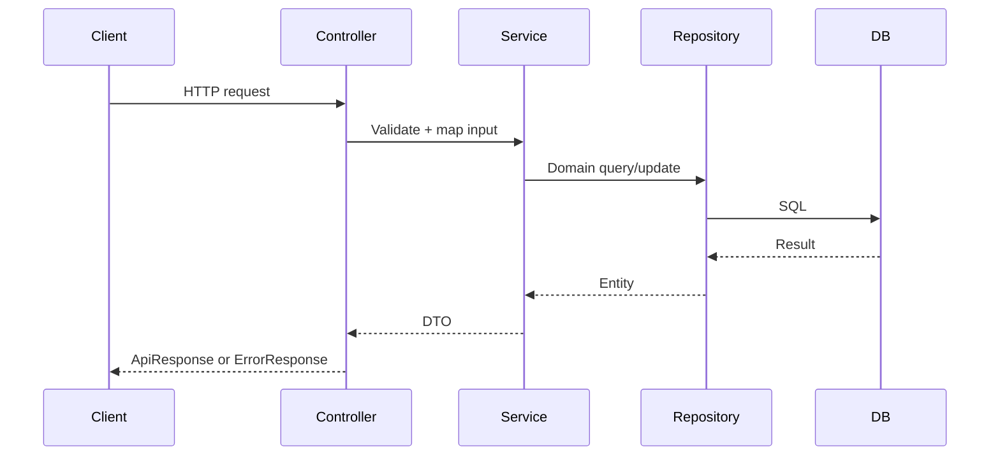

# History Talk Backend - Agent Guide

This file is the single source of truth for rules, architecture, and conventions in the history-talk-backend-Java codebase. Keep it accurate and aligned with the code. If behavior in code differs from this guide, update this guide to match the code.

## Quick Facts
- Stack: Spring Boot 3.2, Java 21, PostgreSQL, Hibernate 6.x, Maven.
- Root: Source-code/SWD392_FinalProject_HistoryTalk/history-talk-backend-Java.
- Context path: /Historical-tell, all API paths are /Historical-tell/api/v1/....
- Swagger UI: http://localhost:8080/Historical-tell/api/v1/swagger-ui.
- Layer order: Controller -> Service -> Repository, with DTOs between every layer boundary.

## Architecture Overview
Request flow:
1) Controller validates input DTOs with @Valid and extracts user identity from SecurityUtils.
2) Service handles authorization, ownership checks, business rules, and mapping to DTOs.
3) Repository performs persistence and search queries.
4) GlobalExceptionHandler maps BaseException to ErrorResponse.

Mermaid sequence of a typical request:

## Package Map
Base package: com.historytalk

- config: SecurityConfig and related security/Swagger setup.
- controller: REST endpoints grouped by module.
  - authentication: AuthController
  - character: CharacterController
  - chat: ChatController
  - historicalContext: HistoricalContextController, HistoricalContextDocumentController
  - quiz: QuizController
- dto: Request/response contracts plus ApiResponse and PaginatedResponse.
- entity: JPA entities, enums, and shared entity types.
- exception: BaseException hierarchy and GlobalExceptionHandler.
- repository: Spring Data JPA repositories.
- security: JWT filter/provider and security principals.
- service: Business logic, module subpackages.
- utils: SecurityUtils and helper utilities.

## API Base Paths
Controllers are under /api/v1 and are prefixed by /Historical-tell from spring.mvc.servlet.path.
Examples:
- /Historical-tell/api/v1/auth
- /Historical-tell/api/v1/characters
- /Historical-tell/api/v1/historical-contexts
- /Historical-tell/api/v1/historical-documents
- /Historical-tell/api/v1/chat
- /Historical-tell/api/v1/quizzes

## Module Responsibilities and Rules

### Authentication Module
- Endpoints: register, login, refresh-token, logout, user deactivation.
- Controller uses AuthService and returns ApiResponse wrappers.
- staff/admin registration endpoint is currently commented out in controller; do not enable without coordinating security rules.

Rules:
- Use JWT in Authorization: Bearer <token>.
- AuthService is the only place for auth business logic; controllers are thin.

### Character Module
- CharacterController provides CRUD and context mapping endpoints.
- Role gating: create/update/delete/soft-delete and mapping endpoints require STAFF or ADMIN.

Rules:
- Include role-based visibility for draft/deleted entities in service logic.
- Mapping between characters and contexts uses dedicated service methods; validate ownership and role before mutating.

### Historical Context Module
- HistoricalContextController provides list, detail, create, update, delete, and soft delete.
- Uses pagination and sorting in controller; service enforces role rules for draft/deleted visibility.

Rules:
- Search filters: search, era, category, includeDraft, includeDeleted.
- Soft delete cascades to related entities (documents, characters, quizzes) in service layer.

### Historical Context Document Module
- HistoricalContextDocumentController provides list, search, detail, create, update, and delete.
- Create/update/delete require STAFF or ADMIN.

Rules:
- Content size caps must be enforced in service (large text fields).
- For public reads, respect draft/deleted rules based on role.

### Chat Module
- ChatController manages sessions, messages, and chat history.
- Sessions are created per user, character, and context.

Rules:
- Ownership: non-staff users only operate on their own sessions.
- Staff/admin can delete any session (service checks role before choosing repo query).
- A greeting message is generated by AI on session creation.
- Suggested questions are stored as JSON in Message.suggestedQuestions.

### Quiz Module
- QuizController exposes customer-focused quiz endpoints and results.

Rules:
- Start/submit/history endpoints require CUSTOMER role.
- Soft delete for results/sessions must enforce ownership rules in service.

## Security Model
- JWT is the primary auth mechanism; JwtAuthenticationFilter validates and sets AuthenticatedPrincipal.
- SecurityConfig defines public and protected endpoints.
- SecurityUtils.getUserId() and SecurityUtils.getRoleName() must be used to get identity/role.
- Do not add X-Staff-Id or X-Staff-Role headers to controller method signatures.

SecurityConfig default rules (current behavior):
- Swagger and OpenAPI endpoints are public.
- /api/v1/auth/** is public.
- GET for characters, historical contexts, documents, and quizzes is public.
- /api/v1/chat/** is authenticated.
- POST/PATCH for quizzes is authenticated.

## Response and Error Handling

### Success Responses
- Always wrap payloads in ApiResponse.success(data, message).
- For paginated endpoints, use PaginatedResponse<T> within ApiResponse.
- Return empty body with 204 only when controller explicitly uses ResponseEntity.noContent().

### Error Responses
- Use BaseException subclasses for expected errors:
  - ResourceNotFoundException (404)
  - DataConflictException (409)
  - InvalidRequestException (400)
  - UnauthorizedException (401)
  - SystemException (500)
  - BusinessRuleViolationException for misc rule breaks (RuntimeException)
- GlobalExceptionHandler builds ErrorResponse for BaseException types.
- Validation errors from @Valid return InvalidArgumentResponse with field error map.

## DTO and Validation Conventions
- Controllers accept request DTOs with @Valid.
- Services map entities to response DTOs and never return entities directly.
- When mapping UUID to DTO, convert to String with .toString().
- Keep response types stable; add fields only if required by frontend.

## Entity and Persistence Conventions
- Primary keys are UUID with @GeneratedValue + @UuidGenerator.
- Use @ManyToOne/@OneToMany with FetchType.LAZY.
- Soft delete is represented by deletedAt timestamp; includeDeleted toggles in queries.
- Draft items use isDraft flag; includeDraft toggles in queries.
- createdBy is a User reference on content entities.

Repository query rules:
- Use ILIKE for case-insensitive search in JPQL.
- Do not use LOWER() on entity path expressions (Hibernate 6.x restriction).

## AI Integration (Chat)
- AiServiceClient uses RestClient.Builder injected by Spring Boot; do not replace with RestClient.builder().
- /v1/ai/chat is synchronous; /v1/ai/generate-title is asynchronous.
- Always send characterData and contextData in AI payloads to avoid cross-service callbacks.
- Inner records used for payloads must be package-private or public for Jackson to serialize.

## Database and Migrations
- DB settings are injected via secretKey.properties and env vars.
- Schema name is DB_SCHEMA and must exist before the first run.
- Flyway is disabled in application.properties for this module; migrations live in src/main/resources/db/migration.
- Keep ddl-auto = none unless explicitly approved.

## Developer Workflow
- Build: mvn clean install
- Run: mvn spring-boot:run
- Default port: 8080

## Adding a New Module
Follow this order: entity -> repository -> service -> controller -> DTOs -> SecurityConfig updates.

Checklist:
1) Entity: UUID PK, proper relations, createdBy, deletedAt, isDraft if applicable.
2) Repository: JpaRepository<Entity, UUID> plus search methods using ILIKE.
3) Service: enforce role/ownership, map to DTO, throw BaseException subclasses.
4) Controller: @RequestMapping under /api/v1, @Valid requests, ApiResponse wrappers.
5) SecurityConfig: add endpoint rules if needed; coordinate before editing.

## Shared Files - Coordinate Before Editing
- SecurityConfig.java
- JwtAuthenticationFilter.java
- JwtTokenProvider.java
- GlobalExceptionHandler.java
- application.properties
- pom.xml
