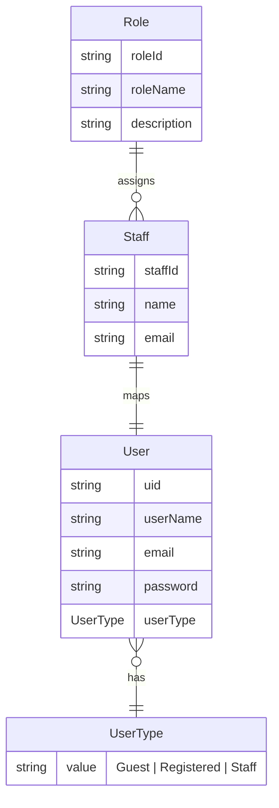
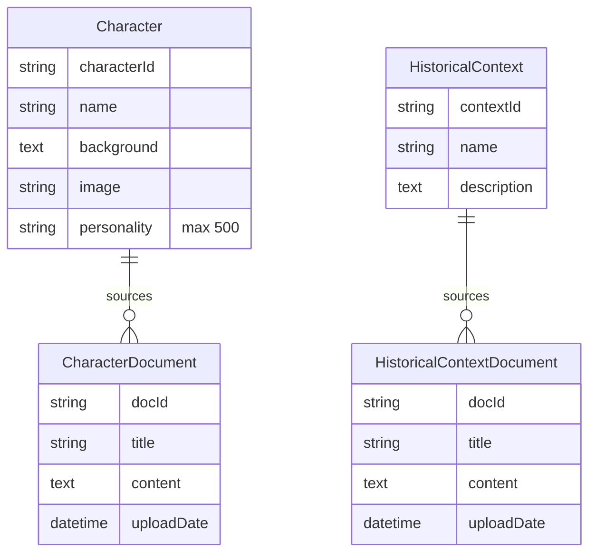
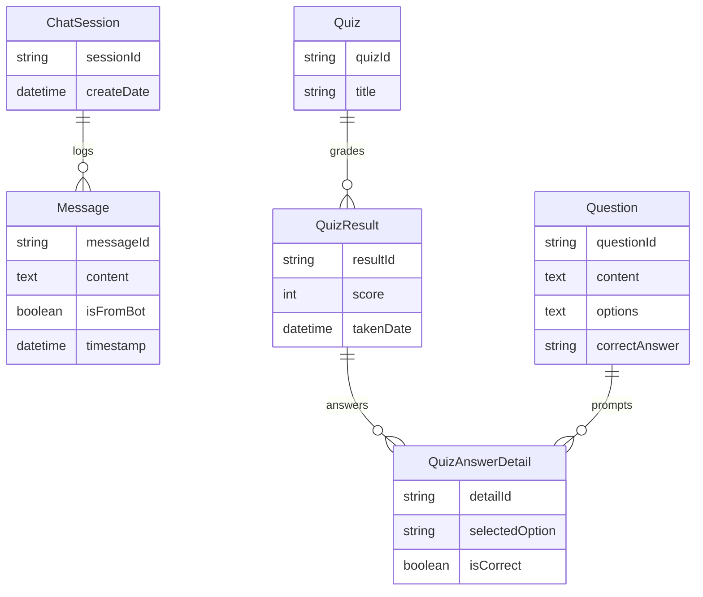

# Slide Crops (Mermaid)

Use VS Code Markdown preview to view and right-click "Save Image" for each diagram.

## Slide 2 – Identity and Access Management

## Slide 3 – Knowledge Base & Persona Modeling

## Slide 4 – Conversational Flow & Assessment

