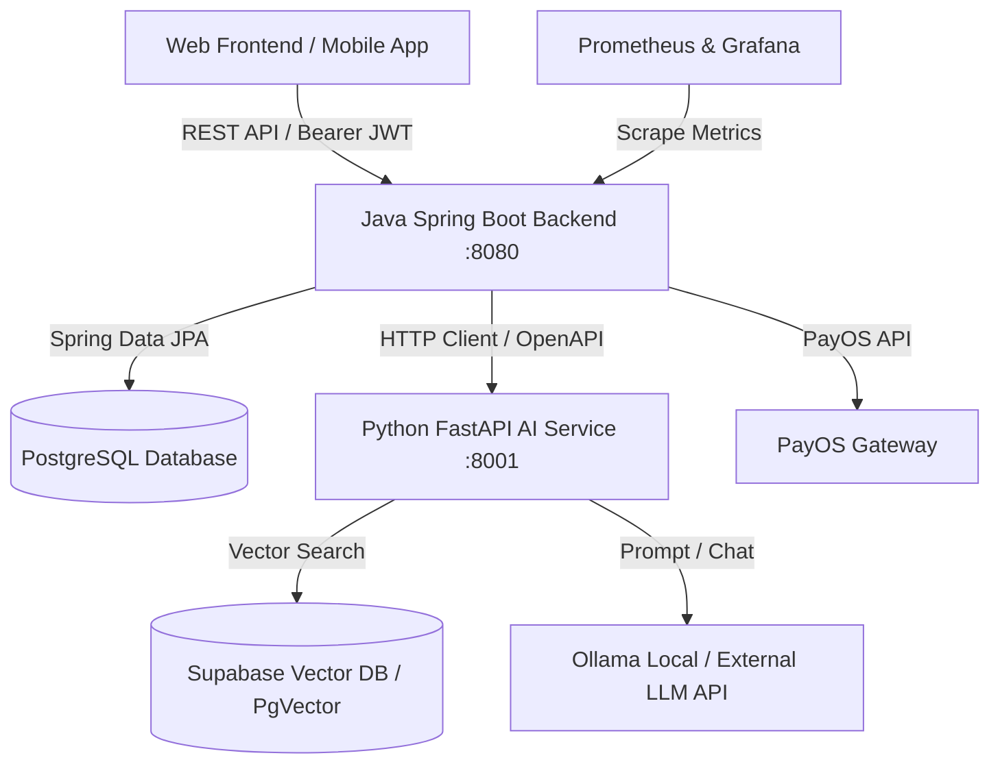
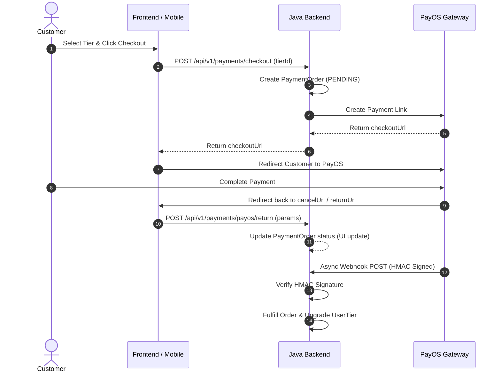

# HistoryTalk Master Business Domain Specification

**Last Updated:** 2026-09-10  
**Target Audience:** New Backend Engineers, AI Engineers, Frontend Developers, and Product Managers joining the HistoryTalk project.

---

## 1. Executive Summary & Architecture Overview

**HistoryTalk** is an interactive history learning platform designed to make history education engaging, reliable, and immersive. Learners browse curated historical events (Contexts), inspect historical figures (Characters), engage in roleplay AI conversations with historical personas, take structured quizzes, earn gamification rewards (XP, Streaks, Tiers), and purchase subscription tiers.

### System Architecture Topology



---

## 2. Actor & Access Control Matrix

The application strictly enforces Role-Based Access Control (RBAC) across all REST endpoints using `@PreAuthorize` annotations and standard Spring Security filters.

### Role Hierarchy & Definitions

| Role (`UserRole`) | Business Definition | Capabilities & Permissions |
| --- | --- | --- |
| `GUEST` | Unauthenticated public visitor. | Browse active/published contexts, characters, documents, and public quizzes. |
| `CUSTOMER` | Registered learner account. | Manage profile, start AI chat sessions, submit quiz answers, check-in daily, complete quests, buy tier packages via PayOS. |
| `STAFF` / `CONTENT_ADMIN` | Content Operator / Educator. | Create & manage draft/published historical contexts, characters, documents, mappings, quizzes, and staff quests. |
| `ADMIN` / `SYSTEM_ADMIN` | Platform Operator / Superadmin. | All staff permissions + manage user accounts, system dashboard metrics, revenue analytics, soft-deleted trash recovery/purge, and global system configurations. |

### Authentication & Token Flow

- **Primary Auth**: Dual-token flow (`accessToken` + `refreshToken`) issued by Java backend (`/api/v1/auth/...`).
- **OAuth Integration**: Google OAuth integration supported for both Web and Mobile devices (`/api/v1/auth/google`).
- **Security Utility**: User ID (`UUID`) and active roles are extracted securely in controllers via `SecurityUtils.getUserId()`.

---

## 3. Core Business Domains & Operational Rules

---

### Domain 1: Historical Context (Bối cảnh Lịch sử)

A **Historical Context** (`HistoricalContext`) represents a historical period, dynasty, battle, campaign, or social movement (e.g., *Trận Bạch Đằng 938*, *Chiến dịch Điện Biên Phủ*). It serves as the primary anchor connecting characters, documents, quizzes, and AI prompts.

#### Key Attributes & Enums
- `name`, `description`, `location`: Human-readable content and location metadata.
- `era` (`EventEra`): Enum defining broad temporal period (e.g., `ANCIENT`, `MEDIEVAL`, `MODERN`, `CONTEMPORARY`).
- `category` (`EventCategory`): Content classification (e.g., `WAR`, `POLITICS`, `CULTURE`, `REVOLUTION`).
- `startYear`, `endYear`, `year`, `beforeTCN`: Time indicators supporting BC/AD date filtering.
- **Content Lifecycle Flags**:
  - `isDraft` (`Boolean`): `true` if content is under preparation by staff; hidden from public learners.
  - `deletedAt` (`Instant`): Soft-delete timestamp. Non-null indicates entry is soft-deleted in Trash.

#### Business Rules
1. **Public Visibility**: Customers and Guests MUST ONLY see published contexts (`isDraft = false` AND `deletedAt IS NULL`).
2. **Staff Workflow**: Staff members create contexts in draft mode, attach documents and characters, and publish when complete.

---

### Domain 2: Historical Character & Decoupled Mappings

A **Character** (`Character`) represents a historical figure (e.g., *Trần Hưng Đạo*, *Võ Nguyên Giáp*).

#### Key Attributes
- `name`, `title`, `background`: Historical identity details.
- `personality`: Roleplay prompt directive guiding how the AI assistant behaves.
- `lifespan`, `side`: Time active and affiliation (e.g., *Nhà Trần*, *Quân đội Nhân dân Việt Nam*).
- `avatarUrl` / `imageUrl`: Media links managed via `MediaUploadStrategyFactory`.
- `isDraft`, `deletedAt`: Standard content lifecycle flags.

#### Decoupled Character-Context Mapping (`CharacterContextMapping`)
- Characters and Contexts are **decoupled entities**. They exist independently and are linked via a mapping table.
- **Business Rationale**: A historical figure (e.g., *Trần Hưng Đạo*) participated in multiple contexts (*Kháng chiến chống Nguyên Mông 1285*, *Trận Bạch Đằng 1288*). Decoupling allows flexible reuse without duplicating character profiles.

```text
[Character: Trần Hưng Đạo] <---> [Mapping] <---> [Context: Bạch Đằng 1288]
                            <---> [Mapping] <---> [Context: Tây Kết 1285]
```

---

### Domain 3: Historical Documents & PDF Extraction Pipeline

**Historical Documents** (`Document`) store background text, source material, and research references attached to contexts or characters.

#### Document Types & Processing
- `DocumentType`: `TEXT`, `MARKDOWN`, `PDF`.
- **Strategy Pattern**: Java uses `DocumentProcessorFactory` to process different types:
  - `TextProcessorStrategy`: Plaintext validation and length check.
  - `MarkdownProcessorStrategy`: HTML sanitization against XSS attacks.
  - `PDF Extraction Integration`: PDF documents are uploaded, processed into raw text chunks, and integrated with Python AI service for text embedding and RAG retrieval.

---

### Domain 4: AI Roleplay Engine & Chat System

The AI Chat system allows customers to have roleplay conversations with historical characters in specific historical contexts.

#### Chat Session Lifecycle & Rules
1. **Session Ownership**: A session (`ChatSession`) is created for a specific `(userId, characterId, contextId)` combination. Users own their sessions (`uid`). Cross-user access is strictly forbidden.
2. **Quota / Token Check**: Prior to session initialization, Java verifies user active Tier token quota and balance.
3. **Auto-Generated Title**: After the initial exchange, Java requests an AI-generated session title summarizing the topic.

#### AI Prompt Pipeline (Python FastAPI Service)
When a user sends a message:
1. Java constructs `ChatAIRequest` containing persona details, historical context background, prior message history, and user input.
2. Python FastAPI constructs the prompt (`prompt_builder.py`):
   - **Persona & Pronouns (`xưng hô`)**: Enforces historical Vietnamese address terms (e.g., *Ta - Ngươi*, *Trẫm - Khanh*, *Tôi - Bạn*) based on character title and context.
   - **Quote Generation**: Includes authentic historical quotes where applicable.
   - **30% Open-Question Logic (`30% ask logic`)**: In ~30% of responses, the AI character proactively asks an open historical question to guide the learner's exploration.
   - **Suggested Follow-up Questions**: Generates 3 relevant follow-up prompts returned in `suggestedQuestions`.
   - **Fallback Greetings**: Handles empty/initial prompts with contextually accurate persona greetings.
3. **Execution Switch**: Configurable switch to route requests between local **Ollama** models and external **LLM APIs** (e.g., Gemini).
4. **Vector Retrieval (RAG)**: Uses Supabase Vector DB with **Semantic Chunking** and Reranking for context retrieval.

---

### Domain 5: Quiz & Assessment System

Quizzes evaluate user comprehension after exploring contexts or engaging in chat sessions.

#### Structure & Metrics
- **Quiz** (`Quiz`): Tied to a `contextId`. Contains `title`, `description`, `grade` (school level), `chapterNumber`, `era`, `durationSeconds`, `playCount`, and `rating`.
- **Question** (`Question`): Belongs to a Quiz. Defines question text, answer options, correct option, and historical explanation.
- **Quiz Session & Result** (`QuizSession`, `QuizResult`, `QuizAnswerDetail`):
  - Tracks user attempt start time, selected options, elapsed duration, score, and completion status.
  - Generates XP rewards upon quiz completion for the Gamification engine.

---

### Domain 6: Gamification (Streak, Quests, Tiers & XP)

Gamification boosts learner retention through daily engagement loops.

```text
Daily Check-in / Quests -> Earn XP & Tokens -> Upgrade Level & Claim Rewards -> Upgrade Tier
```

#### Core Components
1. **Streaks & Daily Check-in** (`DailyCheckIn`): Tracks consecutive login days. Missing a day resets the current streak.
2. **Daily & Weekly Quests** (`DailyQuest`, `UserQuestProgress`):
   - System auto-assigns daily/weekly tasks (e.g., *Complete 1 Quiz*, *Chat with 2 Characters*).
   - **Staff Quests** (`StaffQuestController`): Staff can publish custom event quests with specific XP rewards.
   - **Claim Reward API**: `POST /api/v1/gamification/claim` validates quest completion and grants XP/tokens.
3. **Tiers & Privileges** (`Tier`, `UserTier`):
   - User Tiers: e.g., `FREE`, `VIP`, `PREMIUM`.
   - Defines daily AI chat token limits, access to premium historical contexts, and priority LLM response speeds.

---

### Domain 7: Payment & Subscription Fulfillment

HistoryTalk integrates with **PayOS** for seamless tier purchases.



#### Payment States & Enums
- `PaymentOrderStatus`: `PENDING`, `PAID`, `CANCELLED`, `FAILED`, `EXPIRED`.
- `PaymentTransactionStatus`: `SUCCESS`, `FAILED`.
- `PaymentFulfillmentStatus`: `UNFULFILLED`, `FULFILLED`.

*Security Rule*: The frontend return callback (`/payos/return`) ONLY updates UI state. Actual Tier upgrade and credit fulfillment MUST ONLY occur inside the HMAC-verified PayOS Webhook handler.

---

### Domain 8: System Administration, Dashboard & Trash

#### System Dashboard (`SystemDashboardController`)
Provides real-time business insights for `SYSTEM_ADMIN`:
- `/overview`: System health, active users, total revenue, chat count.
- `/users`: Registration trends, role distribution, active tier counts.
- `/content`: Inventory counts of contexts, characters, documents, and quizzes.
- `/chat-activity`: Daily chat session volume and token consumption.
- `/revenue`: Revenue trends, payment order status breakdown, tier revenue distribution.

#### System Trash (`SystemTrashController`)
Centralized soft-delete management:
- Allows admins to inspect soft-deleted entities across contexts, characters, documents, and quizzes.
- Offers **Restore** (clears `deletedAt`) and **Permanent Purge** (hard SQL delete) capabilities.

---

## 4. Summary of Key Database Enums & ERD Reference

> [!NOTE]
> For the comprehensive Database Analysis, ERD Diagram, Primary/Foreign Key rules, and table schema definitions across all 16+ tables, see **[DATABASE_DESIGN_SPECIFICATION.md](file:///c:/Users/KHAI/Documents/Historical-talk/SWD392_FinalProject_HistoryTalk/docs/DATABASE_DESIGN_SPECIFICATION.md)**.

| Enum Class | Values | Usage |
| --- | --- | --- |
| `UserRole` | `CUSTOMER`, `STAFF` / `CONTENT_ADMIN`, `ADMIN` / `SYSTEM_ADMIN` | Authorization policy across all APIs. |
| `EventEra` | `ANCIENT`, `MEDIEVAL`, `MODERN`, `CONTEMPORARY` | Historical context filtering. |
| `EventCategory` | `WAR`, `POLITICS`, `CULTURE`, `REVOLUTION` | Historical domain category. |
| `DocumentType` | `TEXT`, `MARKDOWN`, `PDF` | Processor strategy selection. |
| `PaymentOrderStatus` | `PENDING`, `PAID`, `CANCELLED`, `FAILED`, `EXPIRED` | PayOS transaction tracking. |
| `QuestType` | `DAILY`, `WEEKLY`, `STAFF_EVENT` | Gamification quest classification. |


---

## 5. New Developer Onboarding & Checklist

### Step 1: Environment Setup
1. **Clone repository**: Ensure line endings are preserved (`core.autocrlf = true` or `input` on Windows).
2. **Java Backend**:
   - SDK: Java 21, Maven 3.9+.
   - Navigate to `Source-code/SWD392_FinalProject_HistoryTalk/history-talk-backend-Java/`.
   - Run compilation check: `mvn -q -DskipTests compile`.
   - Run local server: `mvn spring-boot:run` (Serves on `http://localhost:8080/Historical-tell`).
   - Access Swagger UI: `http://localhost:8080/Historical-tell/api/v1/swagger-ui`.
3. **Python AI Service**:
   - Python 3.11+.
   - Navigate to `Source-code/SWD392_FinalProject_HistoryTalk/history-talk-backend-AI/`.
   - Setup venv: `python -m venv .venv && .venv\Scripts\activate`.
   - Install requirements: `pip install -r requirements.txt`.
   - Run server: `uvicorn history_talk_ai.main:app --reload --port 8001 --app-dir src`.
   - Access FastAPI docs: `http://localhost:8001/docs`.

### Step 2: Key Guidelines & Operational Constraints
- **Markdown & Planning Artifacts**: Markdown documentation must be kept under `docs/` or `docs/services/...`. Never place ad-hoc `.md` files inside source directories.
- **Code Style**: 4-space indentation across Java and Python. Use `camelCase` for Java fields and `snake_case` for Python functions/modules.
- **Verification**: Always run `mvn -q -DskipTests compile` (Java) or test endpoints before submitting PRs.
