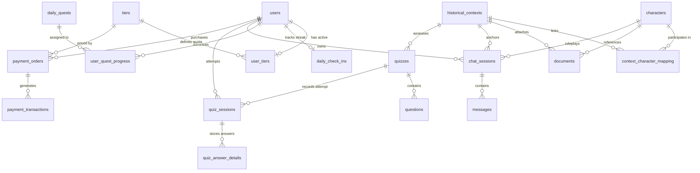

# HistoryTalk Database Design & ERD Specification

**Last Updated:** 2026-09-10  
**Target Audience:** Database Administrators, Backend Engineers, System Architects, and Data Engineers.

---

## 1. Overview & Core Architectural Conventions

The HistoryTalk database is built on **PostgreSQL 16+** managed via **Flyway Schema Migrations**. The design enforces strict relational integrity, UUID primary keys, standardized timestamp tracking, soft-delete lifecycle management, and explicit indexing.

### 1.1 Key Data Type Conventions

| Concept | PostgreSQL Data Type | Java Entity Mapping | Rationale |
| --- | --- | --- | --- |
| **Primary Keys (PK)** | `UUID` | `java.util.UUID` | Guarantees global uniqueness across microservices, AI vector pipelines, and distributed environments without serial sequence collision. Generated via `uuid_generate_v4()` or Java `@GeneratedValue(strategy = GenerationType.UUID)`. |
| **Foreign Keys (FK)** | `UUID` | `java.util.UUID` | Strictly matches PK type for index efficiency and foreign key constraint validation. |
| **Monetary Values** | `DECIMAL(12,2)` / `BIGINT` | `java.math.BigDecimal` / `Long` | Prevents floating-point rounding errors in transactions and payment orders. |
| **JSON / Array Data** | `TEXT` / `JSONB` | `java.lang.String` | Stores structured JSON strings (e.g., suggested questions, option lists, quotes) efficiently. |
| **Timestamps** | `TIMESTAMP WITH TIME ZONE` | `java.time.Instant` / `LocalDateTime` | Preserves absolute UTC time across client locations. |
| **Enumerations** | `VARCHAR(50)` | Java `enum` (`@Enumerated(EnumType.STRING)`) | Uses human-readable string values in SQL instead of ordinal integers to prevent database corruption when enums are reordered. |

### 1.2 Naming Standards

- **Tables & Columns**: `snake_case` in SQL (e.g., `chat_sessions`, `context_id`, `created_at`).
- **Java Entities & Fields**: `PascalCase` for classes and `camelCase` for fields (e.g., `ChatSession`, `contextId`, `createdAt`).
- **Standard Lifecycle Columns**:
  - `created_at` (Java `createdAt`): Instant row was inserted.
  - `updated_at` (Java `updatedAt`): Instant row was last modified.
  - `deleted_at` (Java `deletedAt`): Instant row was soft-deleted (`NULL` indicates active row).
  - `uploaded_at` (Java `uploadedAt`): Specific to `documents` lifecycle.

---

## 2. Complete Entity-Relationship Diagram (ERD)



---

## 3. Module Schema & Relationship Breakdown

---

### Module 1: User & Authentication

#### 1. Table `users`
Stores customer, staff, and admin user accounts.

| Column | Data Type | Constraints | Description |
| --- | --- | --- | --- |
| `uid` | `UUID` | `PRIMARY KEY` | Unique user identity. |
| `email` | `VARCHAR(255)` | `NOT NULL`, `UNIQUE` | Login email address. |
| `password_hash` | `VARCHAR(255)` | `NULLABLE` | BCrypt hash (nullable for OAuth accounts). |
| `full_name` | `VARCHAR(255)` | `NOT NULL` | User display name. |
| `role` | `VARCHAR(50)` | `NOT NULL` | Enum: `CUSTOMER`, `STAFF`, `ADMIN`, `CONTENT_ADMIN`, `SYSTEM_ADMIN`. |
| `avatar_url` | `TEXT` | `NULLABLE` | Profile picture URL. |
| `is_active` | `BOOLEAN` | `DEFAULT true` | Account active state. |
| `last_token_reset_at` | `TIMESTAMPTZ` | `NULLABLE` | Used for revoking active JWTs. |
| `password_reset_token` | `VARCHAR(255)` | `NULLABLE` | Password reset flow token. |
| `password_reset_token_expiry` | `TIMESTAMPTZ` | `NULLABLE` | Expiry time for reset token. |
| `created_at` | `TIMESTAMPTZ` | `NOT NULL` | Row creation timestamp. |
| `updated_at` | `TIMESTAMPTZ` | `NOT NULL` | Last update timestamp. |
| `deleted_at` | `TIMESTAMPTZ` | `NULLABLE` | Soft-delete timestamp. |

---

### Module 2: Content Core (Context, Character, Mapping & Document)

#### 2. Table `historical_contexts`
Anchors historical events, periods, and campaigns.

| Column | Data Type | Constraints | Description |
| --- | --- | --- | --- |
| `context_id` | `UUID` | `PRIMARY KEY` | Unique context identifier. |
| `name` | `VARCHAR(255)` | `NOT NULL` | Event/period name (e.g., *Trận Bạch Đằng 938*). |
| `description` | `TEXT` | `NOT NULL` | Historical background and description. |
| `era` | `VARCHAR(50)` | `NOT NULL` | Enum: `ANCIENT`, `MEDIEVAL`, `MODERN`, `CONTEMPORARY`. |
| `category` | `VARCHAR(50)` | `NOT NULL` | Enum: `WAR`, `POLITICS`, `CULTURE`, `REVOLUTION`. |
| `start_year` | `INT` | `NULLABLE` | Start year indicator. |
| `end_year` | `INT` | `NULLABLE` | End year indicator. |
| `year` | `INT` | `NULLABLE` | Event single year. |
| `before_tcn` | `BOOLEAN` | `DEFAULT false` | `true` if Before Common Era (BCE/TCN). |
| `location` | `VARCHAR(255)` | `NULLABLE` | Geographic location. |
| `is_draft` | `BOOLEAN` | `DEFAULT true` | Draft state (hidden from customers when `true`). |
| `created_at` | `TIMESTAMPTZ` | `NOT NULL` | Creation timestamp. |
| `updated_at` | `TIMESTAMPTZ` | `NOT NULL` | Update timestamp. |
| `deleted_at` | `TIMESTAMPTZ` | `NULLABLE` | Soft-delete timestamp. |

#### 3. Table `characters`
Historical figure profiles for roleplay.

| Column | Data Type | Constraints | Description |
| --- | --- | --- | --- |
| `character_id` | `UUID` | `PRIMARY KEY` | Unique character identifier. |
| `name` | `VARCHAR(255)` | `NOT NULL` | Character full name. |
| `title` | `VARCHAR(255)` | `NULLABLE` | Title / Honorific (e.g., *Hưng Đạo Đại Vương*). |
| `background` | `TEXT` | `NOT NULL` | Biographical details. |
| `personality` | `TEXT` | `NOT NULL` | AI prompt directive guiding tone and style. |
| `lifespan` | `VARCHAR(100)` | `NULLABLE` | Time active/lifespan text. |
| `side` | `VARCHAR(100)` | `NULLABLE` | Faction / Alliance. |
| `avatar_url` | `TEXT` | `NULLABLE` | Profile image URL. |
| `model_url` | `TEXT` | `NULLABLE` | 3D model asset URL (if applicable). |
| `is_draft` | `BOOLEAN` | `DEFAULT true` | Draft state. |
| `created_at` | `TIMESTAMPTZ` | `NOT NULL` | Creation timestamp. |
| `updated_at` | `TIMESTAMPTZ` | `NOT NULL` | Update timestamp. |
| `deleted_at` | `TIMESTAMPTZ` | `NULLABLE` | Soft-delete timestamp. |

#### 4. Table `context_character_mapping` (M:N Decoupled Join Table)
Connects characters to historical contexts.

| Column | Data Type | Constraints | Description |
| --- | --- | --- | --- |
| `mapping_id` | `UUID` | `PRIMARY KEY` | Unique surrogate key for mapping row. |
| `context_id` | `UUID` | `NOT NULL`, `FK -> historical_contexts` | Linked context ID. |
| `character_id` | `UUID` | `NOT NULL`, `FK -> characters` | Linked character ID. |
| `created_at` | `TIMESTAMPTZ` | `NOT NULL` | Mapping creation date. |

- **Unique Constraint**: `UNIQUE (context_id, character_id)` prevents duplicate mapping entries.

#### 5. Table `documents`
Supporting educational text and PDF sources.

| Column | Data Type | Constraints | Description |
| --- | --- | --- | --- |
| `doc_id` | `UUID` | `PRIMARY KEY` | Unique document ID. |
| `context_id` | `UUID` | `NULLABLE`, `FK -> historical_contexts` | Parent context ID. |
| `character_id` | `UUID` | `NULLABLE`, `FK -> characters` | Optional character reference. |
| `title` | `VARCHAR(255)` | `NOT NULL` | Document title. |
| `content` | `TEXT` | `NOT NULL` | Extracted text content / Markdown. |
| `document_type` | `VARCHAR(50)` | `NOT NULL` | Enum: `TEXT`, `MARKDOWN`, `PDF`. |
| `status` | `VARCHAR(50)` | `DEFAULT 'ACTIVE'` | Enum: `ACTIVE`, `DRAFT`, `ARCHIVED`. |
| `uploaded_at` | `TIMESTAMPTZ` | `NOT NULL` | Upload/creation timestamp. |
| `updated_at` | `TIMESTAMPTZ` | `NOT NULL` | Modification timestamp. |
| `deleted_at` | `TIMESTAMPTZ` | `NULLABLE` | Soft-delete timestamp. |

---

### Module 3: AI Chat System

#### 6. Table `chat_sessions`
Learner conversations with characters in specific contexts.

| Column | Data Type | Constraints | Description |
| --- | --- | --- | --- |
| `session_id` | `UUID` | `PRIMARY KEY` | Unique chat session ID. |
| `uid` | `UUID` | `NOT NULL`, `FK -> users.uid` | Owner customer ID. |
| `character_id` | `UUID` | `NOT NULL`, `FK -> characters` | Character being roleplayed. |
| `context_id` | `UUID` | `NOT NULL`, `FK -> historical_contexts` | Historical context scenario. |
| `title` | `VARCHAR(255)` | `NULLABLE` | AI-generated chat topic title. |
| `last_message_at` | `TIMESTAMPTZ` | `NOT NULL` | Timestamp of latest exchange. |
| `created_at` | `TIMESTAMPTZ` | `NOT NULL` | Creation timestamp. |
| `updated_at` | `TIMESTAMPTZ` | `NOT NULL` | Update timestamp. |
| `deleted_at` | `TIMESTAMPTZ` | `NULLABLE` | Soft-delete timestamp. |

#### 7. Table `messages`
Individual dialog entries in a chat session.

| Column | Data Type | Constraints | Description |
| --- | --- | --- | --- |
| `message_id` | `UUID` | `PRIMARY KEY` | Unique message ID. |
| `session_id` | `UUID` | `NOT NULL`, `FK -> chat_sessions` | Parent chat session ID. |
| `role` | `VARCHAR(50)` | `NOT NULL` | Enum: `USER`, `ASSISTANT`. |
| `content` | `TEXT` | `NOT NULL` | Dialog message body. |
| `suggested_questions` | `TEXT` | `NULLABLE` | JSON array string of 3 follow-up prompts. |
| `quotes` | `TEXT` | `NULLABLE` | JSON array string of historical quotes. |
| `message_type` | `VARCHAR(50)` | `DEFAULT 'TEXT'` | Enum: `TEXT`, `SYSTEM_GREETING`. |
| `tokens_used` | `INT` | `DEFAULT 0` | LLM tokens consumed. |
| `created_at` | `TIMESTAMPTZ` | `NOT NULL` | Message timestamp. |

---

### Module 4: Quizzes & Assessment

#### 8. Table `quizzes`
Assessment tests linked to contexts.

| Column | Data Type | Constraints | Description |
| --- | --- | --- | --- |
| `quiz_id` | `UUID` | `PRIMARY KEY` | Unique quiz ID. |
| `context_id` | `UUID` | `NOT NULL`, `FK -> historical_contexts` | Associated historical context. |
| `title` | `VARCHAR(255)` | `NOT NULL` | Quiz title. |
| `description` | `TEXT` | `NULLABLE` | Quiz overview text. |
| `grade` | `INT` | `NULLABLE` | Target school grade (e.g., 6..12). |
| `chapter_number` | `INT` | `NULLABLE` | Curriculum chapter index. |
| `chapter_title` | `VARCHAR(255)` | `NULLABLE` | Curriculum chapter title. |
| `era` | `VARCHAR(50)` | `NULLABLE` | Enum: `ANCIENT`, `MEDIEVAL`, `MODERN`, `CONTEMPORARY`. |
| `duration_seconds` | `INT` | `DEFAULT 600` | Allowed completion time limit. |
| `play_count` | `INT` | `DEFAULT 0` | Total user attempts count. |
| `rating` | `DOUBLE PRECISION`| `DEFAULT 5.0` | Customer review score. |
| `is_active` | `BOOLEAN` | `DEFAULT true` | Published status. |
| `created_at` | `TIMESTAMPTZ` | `NOT NULL` | Creation timestamp. |
| `updated_at` | `TIMESTAMPTZ` | `NOT NULL` | Update timestamp. |
| `deleted_at` | `TIMESTAMPTZ` | `NULLABLE` | Soft-delete timestamp. |

#### 9. Table `questions`
Question items inside a Quiz.

| Column | Data Type | Constraints | Description |
| --- | --- | --- | --- |
| `question_id` | `UUID` | `PRIMARY KEY` | Unique question ID. |
| `quiz_id` | `UUID` | `NOT NULL`, `FK -> quizzes` | Parent quiz ID. |
| `question_text` | `TEXT` | `NOT NULL` | Question statement. |
| `options` | `TEXT` | `NOT NULL` | JSON array string of choices `["A", "B", "C", "D"]`. |
| `correct_option` | `INT` | `NOT NULL` | Index of correct option (0-based). |
| `explanation` | `TEXT` | `NULLABLE` | Answer explanation detail. |
| `created_at` | `TIMESTAMPTZ` | `NOT NULL` | Creation timestamp. |
| `updated_at` | `TIMESTAMPTZ` | `NOT NULL` | Update timestamp. |

#### 10. Table `quiz_sessions` & `quiz_answer_details`
Tracks user attempts and selected answers.
- `quiz_sessions`: `session_id` (PK), `uid` (FK -> users), `quiz_id` (FK -> quizzes), `score`, `start_time`, `end_time`, `status`.
- `quiz_answer_details`: `detail_id` (PK), `session_id` (FK -> quiz_sessions), `question_id` (FK -> questions), `selected_option`, `is_correct`.

---

### Module 5: Gamification & Quests

#### 11. Table `tiers` & `user_tiers`
User subscription tiers and daily token allowances.
- `tiers`: `tier_id` (PK), `name`, `code` (`FREE`, `VIP`, `PREMIUM`), `price`, `daily_token_limit`, `priority_level`.
- `user_tiers`: `id` (PK), `uid` (FK -> users, `UNIQUE`), `tier_id` (FK -> tiers), `expires_at`, `tokens_remaining`.

#### 12. Table `daily_check_ins`, `daily_quests` & `user_quest_progress`
- `daily_check_ins`: `id` (PK), `uid` (FK -> users, `UNIQUE`), `current_streak`, `longest_streak`, `last_check_in_date`.
- `daily_quests`: `quest_id` (PK), `title`, `description`, `quest_type` (`DAILY`, `WEEKLY`, `STAFF_EVENT`), `reward_xp`, `target_count`.
- `user_quest_progress`: `id` (PK), `uid` (FK -> users), `quest_id` (FK -> daily_quests), `current_count`, `is_claimed`, `claimed_at`. Unique constraint `UNIQUE (uid, quest_id)`.

---

### Module 6: Payments & Orders

#### 13. Table `payment_orders`
Stores PayOS checkout orders.

| Column | Data Type | Constraints | Description |
| --- | --- | --- | --- |
| `order_id` | `UUID` | `PRIMARY KEY` | Internal order UUID. |
| `order_code` | `BIGINT` | `NOT NULL`, `UNIQUE` | PayOS numeric order code. |
| `uid` | `UUID` | `NOT NULL`, `FK -> users` | Purchasing user ID. |
| `tier_id` | `UUID` | `NOT NULL`, `FK -> tiers` | Purchased subscription tier ID. |
| `amount` | `DECIMAL(12,2)` | `NOT NULL` | Payment amount in VND. |
| `status` | `VARCHAR(50)` | `NOT NULL` | Enum: `PENDING`, `PAID`, `CANCELLED`, `FAILED`, `EXPIRED`. |
| `fulfillment_status` | `VARCHAR(50)`| `DEFAULT 'UNFULFILLED'`| Enum: `UNFULFILLED`, `FULFILLED`. |
| `checkout_url` | `TEXT` | `NULLABLE` | PayOS checkout URL. |
| `created_at` | `TIMESTAMPTZ` | `NOT NULL` | Order creation date. |
| `updated_at` | `TIMESTAMPTZ` | `NOT NULL` | Order update date. |

#### 14. Table `payment_transactions`
Payment gateway execution logs.
- `transaction_id` (PK), `order_id` (FK -> payment_orders), `transaction_code`, `amount`, `status` (`SUCCESS`, `FAILED`), `payos_response`, `created_at`.

---

## 4. Foreign Key Constraints & Soft Delete Rules

### 4.1 Foreign Key Cascade Policy

To protect audit history, financial records, and learning analytics, HistoryTalk strictly enforces **No Hard Cascade Deletes (`ON DELETE RESTRICT` or `ON DELETE SET NULL`)** on core content:

```text
User Soft Deleted (deleted_at != NULL) 
  -> payment_orders RETAINED (for revenue audit)
  -> chat_sessions RETAINED
  -> quiz_sessions RETAINED

Context Soft Deleted (deleted_at != NULL)
  -> quizzes RETAINED (deleted_at updated via SoftDeleteService)
  -> chat_sessions RETAINED
  -> context_character_mapping RETAINED
```

### 4.2 SQL Indexing Strategy

Critical indexes created for production performance:

```sql
-- Chat Session Lookup by User & Context
CREATE INDEX idx_chat_session_uid ON chat_sessions(uid);
CREATE INDEX idx_chat_session_context_character ON chat_sessions(context_id, character_id);

-- Message History Lookup
CREATE INDEX idx_message_session ON messages(session_id, created_at ASC);

-- Soft Delete Filter Indexes (Active Content)
CREATE INDEX idx_context_active ON historical_contexts(is_draft, deleted_at) WHERE deleted_at IS NULL;
CREATE INDEX idx_character_active ON characters(is_draft, deleted_at) WHERE deleted_at IS NULL;

-- Payment History Lookup
CREATE INDEX idx_payment_order_uid ON payment_orders(uid, created_at DESC);
CREATE UNIQUE INDEX idx_payment_order_code ON payment_orders(order_code);
```
