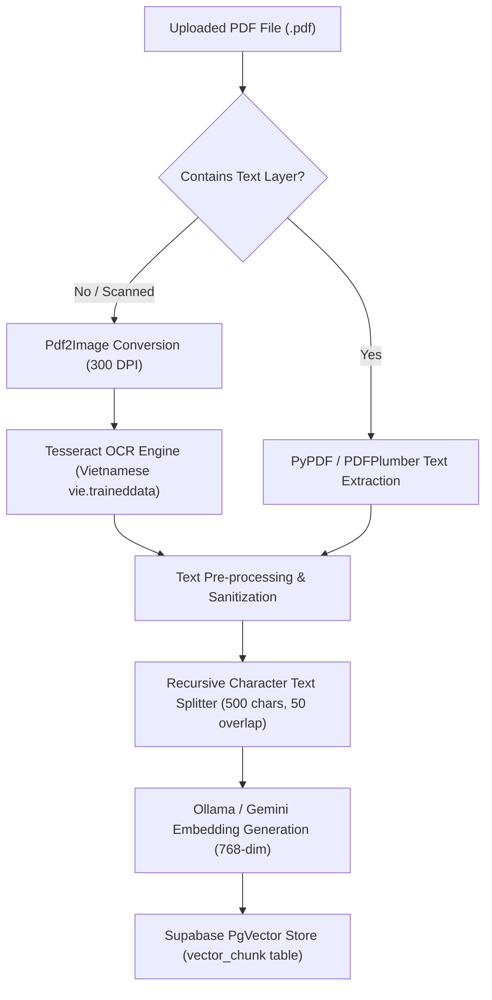

# 🤖 HistoryTalk AI Service - PDF RAG & OCR Pipeline Specification

This specification details the text extraction, Tesseract OCR enhancement, chunking, vector embedding, and Supabase PgVector storage pipeline for processing historical PDF documents.

---

## 1. Document Extraction & OCR Pipeline

---

## 2. Chunking & Embedding Specs

- **Chunk Size**: 500 characters.
- **Overlap**: 50 characters (preserves sentence boundaries across chunk splits).
- **Embedding Dimensions**: 768 dimensions (`bge-m3` or `nomic-embed-text` via Ollama / Gemini Embeddings).
- **OCR Quality Threshold**: 300 DPI image rendering, language `vie` (Vietnamese).

---

## 3. RAG Retrieval API Endpoints

| Method | Endpoint | Access Level | Description |
|---|---|---|---|
| `POST` | `/v1/ai/documents/embed` | Java Backend | Ingest PDF content, generate vector chunks, and save to Supabase. |
| `DELETE` | `/v1/ai/documents/{docId}` | Java Backend | Purge all vector chunks associated with a document ID. |
| `POST` | `/v1/ai/chat` | Java Backend | Perform RAG vector similarity search (`match_history_chunks`), construct persona prompt, and stream AI chat response. |
