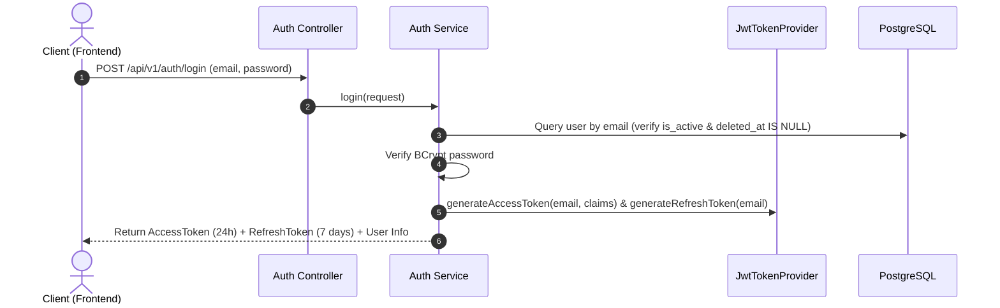
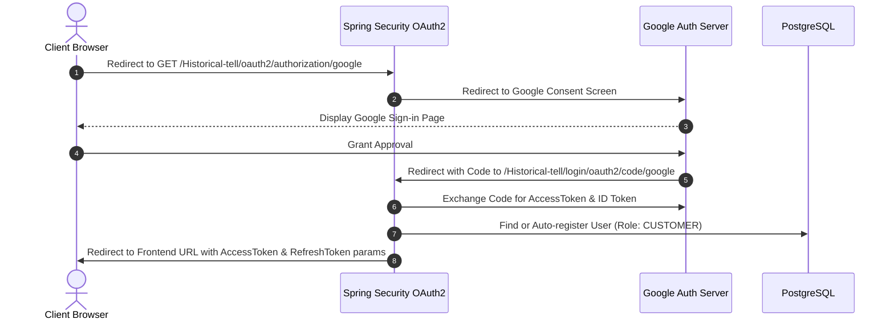

# 🔐 HistoryTalk Java Backend - Authentication & OAuth2 Specification

This specification unifies the design, implementation, API contracts, and Google OAuth2 integration for the HistoryTalk Authentication Module (`com.historytalk.security` and `com.historytalk.service.authentication`).

---

## 1. Overview & Security Architecture

HistoryTalk uses **Stateless JWT Authentication** with **Dual-Token Mechanics (Access Token + Refresh Token)** and **Role-Based Access Control (RBAC)**.

### Roles & Permissions (RBAC)
- **`CUSTOMER`**: Default registered user. Access to chat sessions, quizzes, public characters/contexts, and payment checkout.
- **`CONTENT_ADMIN`**: Content manager. Can manage characters, contexts, documents, media uploads, and quizzes.
- **`SYSTEM_ADMIN`**: System administrator. Full system access, including staff registration and payment management.

---

## 2. JWT Configuration & Claims

### Access Token Claims
- `sub`: User email address
- `uid`: User UUID (stored in DB)
- `role`: Role enum string (`CUSTOMER` | `CONTENT_ADMIN` | `SYSTEM_ADMIN`)
- `exp`: Expiration timestamp (Default: 24 hours / `86,400,000` ms)

### Refresh Token
- Contains subject (`email`) and extended expiry (Default: 7 days / `604,800,000` ms).
- Used via POST `/api/v1/auth/refresh-token` to obtain a new Access Token.

---

## 3. Google OAuth2 Integration Flow

HistoryTalk supports 1-Click Social Sign-In via **Google OAuth2**.

### OAuth2 Configuration Keys
- `spring.security.oauth2.client.registration.google.client-id`
- `spring.security.oauth2.client.registration.google.client-secret`
- `app.oauth2.success-redirect-url`: `http://localhost:5173/oauth2/success`
- `app.oauth2.failure-redirect-url`: `http://localhost:5173/oauth2/failure`

---

## 4. Auth API Endpoints Reference

| HTTP Method | Endpoint | Access Level | Description |
|---|---|---|---|
| `POST` | `/api/v1/auth/register` | Public | Register a new CUSTOMER account. |
| `POST` | `/api/v1/auth/login` | Public | Authenticate with email/password and receive JWT tokens. |
| `POST` | `/api/v1/auth/refresh-token` | Public | Exchange valid Refresh Token for a new Access Token. |
| `POST` | `/api/v1/auth/logout` | Authenticated | Blacklist current JWT token on server. |
| `POST` | `/api/v1/auth/forgot-password` | Public | Request password reset token via email. |
| `POST` | `/api/v1/auth/reset-password` | Public | Reset password using email token. |
| `POST` | `/api/v1/auth/register-staff` | `SYSTEM_ADMIN` | Register a new CONTENT_ADMIN or SYSTEM_ADMIN account. |
| `GET` | `/Historical-tell/oauth2/authorization/google` | Public | Initiate Google OAuth2 login redirect. |
