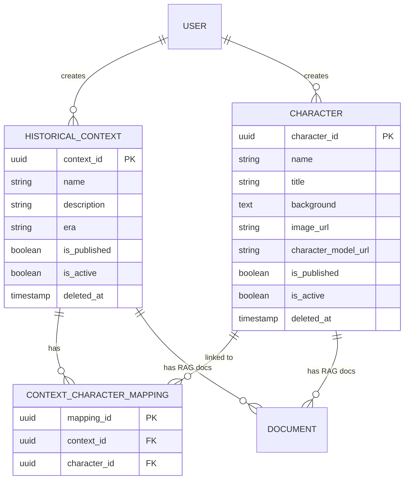

# 🗿 HistoryTalk Java Backend - Character & Historical Context Specification

This specification covers the domain model, entity decoupling, draft/publish lifecycle, 3D model asset integration, and Document Strategy pattern for Historical Characters and Contexts.

---

## 1. Domain Decoupling Architecture

Historically, `Character` and `HistoricalContext` were tightly coupled. HistoryTalk refactored this into a decoupled Many-to-Many architecture:

---

## 2. Draft / Publish / Trash Lifecycle

Both Characters and Historical Contexts support a clean 3-state lifecycle:

1. **Draft State (`is_published = FALSE`, `is_active = TRUE`, `deleted_at IS NULL`)**:
   - Created by `CONTENT_ADMIN` or `SYSTEM_ADMIN`. Visible only to admins for content editing.
2. **Published State (`is_published = TRUE`, `is_active = TRUE`, `deleted_at IS NULL`)**:
   - Publicly accessible via `/api/v1/characters` and `/api/v1/historical-contexts` for all users and AI Chat sessions.
3. **Trash State (`is_active = FALSE` or `deleted_at IS NOT NULL`)**:
   - Soft-deleted items. Excluded from normal API lists. Can be restored or permanently purged via Admin Trash management.

---

## 3. 3D Model Asset Integration (`character_model_url`)

Each Character entity supports a 3D avatar GLTF/GLB model URL (`character_model_url`) for interactive web rendering.
- Allowed 3D formats: `.glb`, `.gltf`, `.obj`, `.fbx`.
- Max size limit: 100MB.
- Document processor sanitizes and validates media links uploaded to Supabase Storage.

---

## 4. API Endpoints Reference

| Method | Endpoint | Access Level | Description |
|---|---|---|---|
| `GET` | `/api/v1/characters` | Public | List all published, active characters. |
| `GET` | `/api/v1/characters/{id}` | Public | Get character details by ID. |
| `POST` | `/api/v1/characters` | `CONTENT_ADMIN` | Create a new character (Draft/Published). |
| `PUT` | `/api/v1/characters/{id}` | `CONTENT_ADMIN` | Update character info & 3D model URL. |
| `DELETE` | `/api/v1/characters/{id}` | `CONTENT_ADMIN` | Soft-delete character to Trash. |
| `GET` | `/api/v1/historical-contexts` | Public | List all published historical contexts. |
| `POST` | `/api/v1/historical-contexts` | `CONTENT_ADMIN` | Create a new historical context. |
