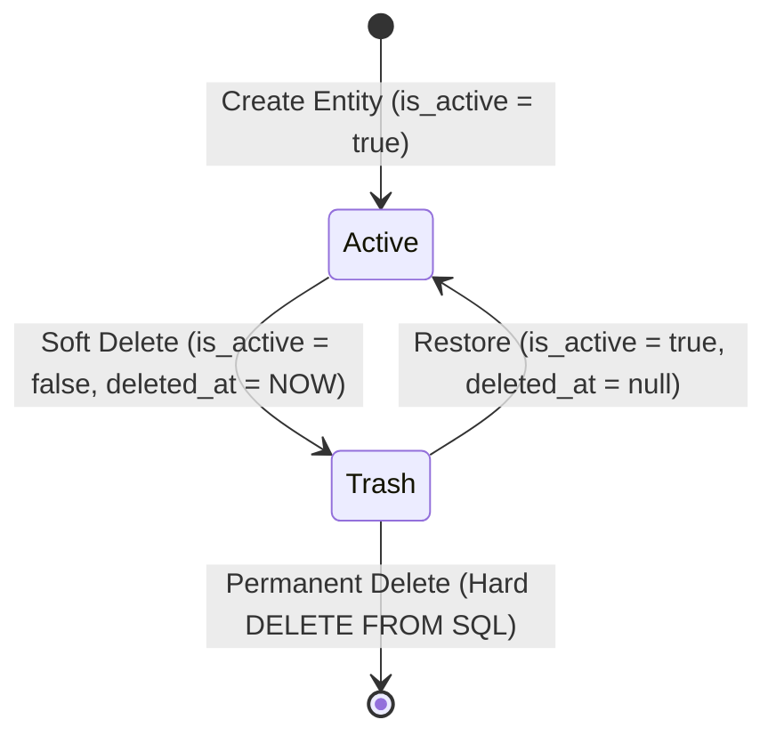

# 🗑️ HistoryTalk Java Backend - Soft Delete & Trash Specification

This specification documents the Soft Delete architecture, Foreign Key constraint handling without Hibernate `@Where`, and the Admin Trash Can lifecycle.

---

## 1. Soft Delete & FK Constraint Conflict Solution

Traditional Hibernate `@Where(clause = "deleted_at IS NULL")` causes severe foreign key reference issues when querying entity relationships (e.g. `user_tier -> user` or `chat_session -> character`). If a referenced parent is soft-deleted, Hibernate generates SQL with `WHERE deleted_at IS NULL`, resulting in `EntityNotFoundException` on valid FK references.

### HistoryTalk Architectural Solution:
1. **Explicit Repository Filters**:
   - Remove `@Where` from JPA Entities.
   - Use explicit Spring Data JPA query methods (`findByDeletedAtIsNull()`, `findAllByIsActiveTrue()`).
2. **Explicit Foreign Key Cascades**:
   - Database DDL handles FK constraints (`ON DELETE CASCADE` or `ON DELETE SET NULL`).
   - Soft-delete queries explicitly set `deleted_at = CURRENT_TIMESTAMP` and `is_active = FALSE` without mutating FK values.

```sql
-- Pattern for Soft-Deleting an entity in HistoryTalk
UPDATE historical_schema."character"
SET is_active = FALSE,
    deleted_at = CURRENT_TIMESTAMP
WHERE character_id = :characterId;
```

---

## 2. Trash Can Management Lifecycle

All soft-deleted items (`is_active = FALSE` or `deleted_at IS NOT NULL`) move to the **Trash Can**.



---

## 3. Trash Management API Reference

| Method | Endpoint | Access Level | Description |
|---|---|---|---|
| `GET` | `/api/v1/trash` | `SYSTEM_ADMIN` | List all soft-deleted items in Trash Can (Characters, Contexts, Quizzes, Documents). |
| `POST` | `/api/v1/trash/{entityType}/{entityId}/restore` | `SYSTEM_ADMIN` | Restore a soft-deleted item back to Active state. |
| `DELETE` | `/api/v1/trash/{entityType}/{entityId}/purge` | `SYSTEM_ADMIN` | Permanently delete an item from Database (Hard Delete). |
