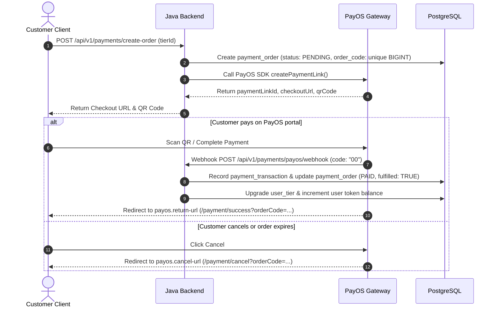

# 💳 HistoryTalk Java Backend - Payment & Billing Specification (PayOS)

This specification details the payment flow, PayOS checkout integration, webhook fulfillment, subscription tier management, and billing history tracking.

---

## 1. Overview & Subscription Model

HistoryTalk offers tier-based subscriptions (`free`, `plus`, `pro`) that grant monthly AI chat tokens:

| Tier Title | Price (VND) | Monthly Tokens | Duration |
|---|---|---|---|
| `free` | 0 VND | 20 tokens | 1 Month |
| `plus` | 49,000 VND | 100 tokens | 1 Month |
| `pro` | 99,000 VND | 999 tokens | 1 Month |

---

## 2. Payment Flow Architecture (PayOS Integration)

---

## 3. Order Fulfillment & Double-Fulfillment Protection

To guarantee 100% reliability even if Webhook delivery is delayed or retried:
1. **Webhook Handler (`/payos/webhook`)**:
   - Validates PayOS HMAC signature key (`payos.checksum-key`).
   - Checks `payment_order.fulfilled == FALSE`.
   - Idempotently updates order status to `PAID`, sets `fulfilled = true`, `fulfilled_at = NOW()`.
   - Upgrades `user_tier` active record and adds `limited_token` to `user.token`.

2. **Frontend Return Callback (`/finish-payment`)**:
   - When client lands on return URL, client calls `POST /api/v1/payments/finish-payment?orderCode=...`.
   - Backend queries PayOS API directly to check actual payment status. If paid and `fulfilled == false`, executes fulfillment immediately.

---

## 4. Payment API Endpoints Reference

| Method | Endpoint | Access Level | Description |
|---|---|---|---|
| `GET` | `/api/v1/payments/tiers` | Public | List all active subscription pricing tiers (`free`, `plus`, `pro`). |
| `POST` | `/api/v1/payments/create-order` | Authenticated | Create a new PayOS payment order for a selected tier. |
| `POST` | `/api/v1/payments/finish-payment` | Authenticated | Process order completion & verify payment status on return URL redirect. |
| `GET` | `/api/v1/payments/history` | Authenticated | Get current user's payment order history. |
| `GET` | `/api/v1/payments/admin/history` | `SYSTEM_ADMIN` | List all system payment transactions with pagination & status filters. |
| `POST` | `/api/v1/payments/payos/webhook` | Public | Webhook listener endpoint for PayOS payment notifications. |
