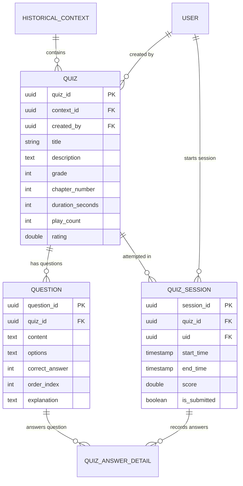

# 🎯 HistoryTalk Java Backend - Quiz Gamification Specification

This specification documents the Quiz domain architecture, historical context association, question bank management, scoring, attempt session tracking, and user answer details.

---

## 1. Domain ERD & Relations

The Quiz module bridges historical education with interactive gamification quizzes:

---

## 2. Quiz Attempt Lifecycle & Auto-Scoring

1. **Start Quiz Session (`POST /api/v1/quizzes/{id}/start`)**:
   - Creates a `quiz_session` with `start_time = NOW()` and `is_submitted = false`.
   - Returns randomized questions with hidden `correct_answer` fields.

2. **Submit Quiz Attempt (`POST /api/v1/quizzes/sessions/{sessionId}/submit`)**:
   - Takes array of user answers `{ questionId, selectedOption }`.
   - Validates each answer against `question.correct_answer`.
   - Computes overall score percentage: `(correct_count / total_questions) * 10.0`.
   - Records individual `quiz_answer_detail` entries with correctness boolean.
   - Increments `quiz.play_count`.

---

## 3. Quiz API Endpoints Reference

| Method | Endpoint | Access Level | Description |
|---|---|---|---|
| `GET` | `/api/v1/quizzes` | Public | List all quizzes with filtering by `contextId`, `grade`, or `era`. |
| `GET` | `/api/v1/quizzes/{id}` | Public | Get quiz info and question list. |
| `POST` | `/api/v1/quizzes` | `CONTENT_ADMIN` | Create a new quiz module linked to a historical context. |
| `PATCH` | `/api/v1/quizzes/{id}` | `CONTENT_ADMIN` | Update quiz title, grade, duration, or questions. |
| `DELETE` | `/api/v1/quizzes/{id}` | `CONTENT_ADMIN` | Soft-delete a quiz. |
| `POST` | `/api/v1/quizzes/{id}/start` | Authenticated | Start a new quiz attempt session. |
| `POST` | `/api/v1/quizzes/sessions/{sessionId}/submit` | Authenticated | Submit quiz answers and receive score report. |
| `GET` | `/api/v1/quizzes/sessions/{sessionId}` | Authenticated | Get detailed result of a completed quiz session. |
