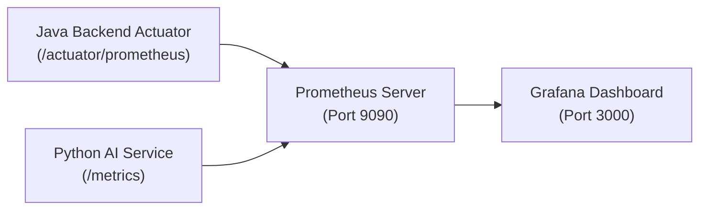

# 📊 HistoryTalk Infrastructure - Monitoring & Grafana Specification

This specification documents the Prometheus metrics scraping setup, Actuator integration, IP filtering security, Grafana dashboard configuration, and quick start guide for system observability.

---

## 1. Monitoring Stack Architecture



---

## 2. Security & IP Filtering for Actuator

Spring Boot `/actuator/prometheus` is protected in `SecurityConfig.java` to restrict access strictly to internal monitoring IP addresses (Prometheus server / localhost):

```java
@Bean
@Order(1)
public SecurityFilterChain actuatorFilterChain(HttpSecurity http) throws Exception {
    http.securityMatcher("/actuator/**")
        .csrf(csrf -> csrf.disable())
        .sessionManagement(session -> session.sessionCreationPolicy(SessionCreationPolicy.STATELESS))
        .authorizeHttpRequests(auth -> auth
            .requestMatchers("/actuator/health").permitAll()
            .requestMatchers("/actuator/prometheus")
            .access((authentication, context) ->
                new AuthorizationDecision(isMonitoringIpAllowed(context.getRequest())))
            .anyRequest().denyAll()
        );
    return http.build();
}
```

Configured via property `monitoring.allowed-ips=127.0.0.1,0:0:0:0:0:0:0:1,172.18.0.0/16`.

---

## 3. Quick Start: Launching Monitoring Infrastructure

To spin up Prometheus and Grafana locally:

```bash
cd Source-code/SWD392_FinalProject_HistoryTalk/monitoring
docker compose -f docker-compose.monitoring.yml up -d
```

### Dashboard Access URLs
- **Grafana UI**: `http://localhost:3000` (User: `admin` / Password: `adminpassword`)
- **Prometheus UI**: `http://localhost:9090`
- **Java Metrics Endpoint**: `http://localhost:8080/Historical-tell/actuator/prometheus`
