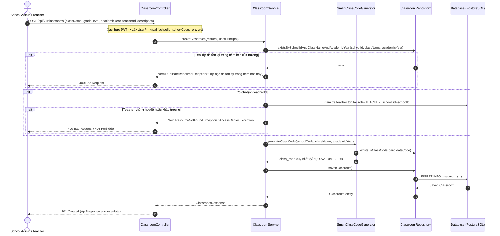
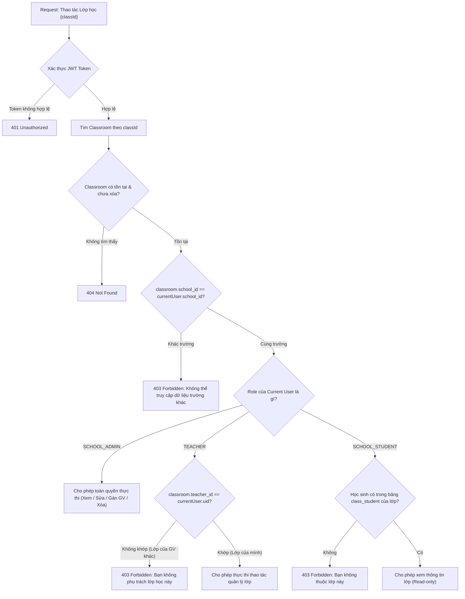
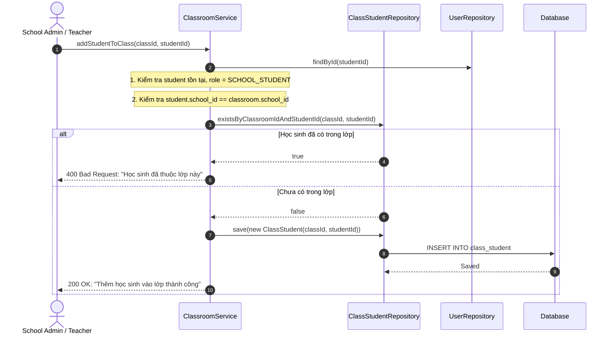
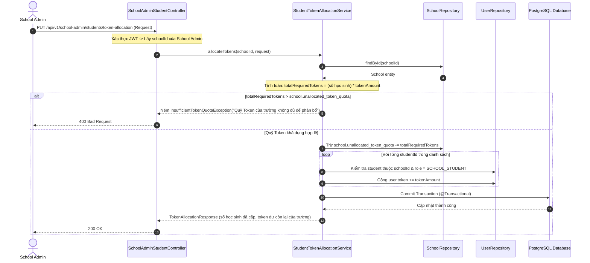

# 🔄 SPRINT 5 — LUỒNG NGHIỆP VỤ CHI TIẾT (BUSINESS FLOWS SPECIFICATION)
> **Phân hệ:** Quản lý Lớp học SaaS, Phân quyền Giáo viên & Cơ chế Phân bổ Token Học sinh  
> **Áp dụng cho:** Sprint 5 (04/10/2026 – 10/10/2026)  
> **Lập trình viên phụ trách:** Trần Quốc Dinh (`DinhTQ`) & Võ Đồng Đức Khải (`KhaiVDD`)  

---

## 📑 MỤC LỤC CÁC LUỒNG NGHIỆP VỤ

1. [Luồng 1: Tạo Lớp học & Thuật toán Sinh Mã Lớp Thông minh (Smart Class Code)](#1-luồng-1-tạo-lớp-học--thuật-toán-sinh-mã-lớp-thông-minh)
2. [Luồng 2: Gán Giáo viên & Phân quyền Quản lý Lớp học (Teacher Assignment & RBAC)](#2-luồng-2-gán-giáo-viên--phân-quyền-quản-lý-lớp-học)
3. [Luồng 3: Liên kết Học sinh - Lớp học (Class-Student Association)](#3-luồng-3-liên-kết-học-sinh---lớp-học-class-student-association)
4. [Luồng 4: Cơ chế School Admin Phân bổ Hạn mức Token cho Học sinh](#4-luồng-4-cơ-chế-school-admin-phân-bổ-hạn-mức-token-cho-học-sinh)
5. [Luồng 5: Truy xuất Danh sách & Chi tiết Lớp học theo Đa vai trò (Multi-Role Access)](#5-luồng-5-truy-xuất-danh-sách--chi-tiết-lớp-học-theo-đa-vai-trò)

---

## 1. LUỒNG 1: TẠO LỚP HỌC & THUẬT TOÁN SINH MÃ LỚP THÔNG MINH

### 🎯 Mục tiêu nghiệp vụ:
Cho phép `School Admin` (hoặc `Teacher`) tạo mới một lớp học. Hệ thống tự động sinh ra một **Mã Lớp (`class_code`)** mang tính gợi nhớ cao, chứa mã trường (`school_code`), tên lớp và niên khóa, đồng thời đảm bảo tính duy nhất tuyệt đối.

### 📐 Thuật toán Sinh Mã Lớp Thông minh (Smart Semantic Class Code Generator):
1. **Lấy `school_code`** từ tài khoản của người tạo (Ví dụ: Trường Chu Văn An $\rightarrow$ `CVA`).
2. **Chuẩn hóa Tên lớp (`clean_class_name`):**
   * Loại bỏ các tiền tố thông dụng như `"Lớp "`, `"Lop "`, `"Class "`.
   * Loại bỏ khoảng trắng và chuyển thành chữ HOA không dấu (Ví dụ: `"Lớp 10A1"` $\rightarrow$ `"10A1"`, `"Lớp 12 Chuyên Sử"` $\rightarrow$ `"12SU"`).
3. **Định dạng mã cơ bản:**  
   $$\text{Mã Lớp} = \text{MÃ\_TRƯỜNG} - \text{TÊN\_LỚP\_CHUẨN\_HÓA} - \text{NĂM\_HỌC}$$
   *(Ví dụ: `CVA-10A1-2026`)*
4. **Kiểm tra va chạm mã (Collision Check):**
   * Tìm kiếm trong Database xem mã `CVA-10A1-2026` đã tồn tại chưa.
   * Nếu chưa tồn tại: Dùng luôn mã này.
   * Nếu đã tồn tại (do trường tạo 2 lớp cùng tên ở 2 cơ sở): Tự động nối thêm hậu tố ngẫu nhiên 3 ký tự viết hoa: `CVA-10A1-2026-X89`.
5. **Kiểm tra ràng buộc trùng tên lớp:** Trong cùng một trường (`school_id`) và cùng một năm học (`academic_year`), không cho phép trùng lặp `class_name` (trừ khi bản ghi cũ đã bị xóa mềm `deleted_at IS NOT NULL`).

### 📊 Sơ đồ Sequence Diagram (Luồng Tạo Lớp):



---

## 2. LUỒNG 2: GÁN GIÁO VIÊN & PHÂN QUYỀN QUẢN LÝ LỚP HỌC

### 🎯 Mục tiêu nghiệp vụ:
* Gán một tài khoản Giáo viên (`User` có `role = TEACHER`) làm giáo viên chủ nhiệm / phụ trách lớp học.
* Thiết lập cơ chế phân quyền 2 tầng đảm bảo:
  1. `School Admin`: Quản lý toàn bộ các lớp thuộc trường mình.
  2. `Teacher`: Chỉ được xem và quản lý lớp học mà mình được phân công phụ trách.

### 📋 Cấu trúc Đối tượng Giáo viên gắn với Lớp học (`TeacherSummaryDto`):
Khi trả về thông tin lớp học, object Giáo viên phụ trách hiển thị các trường:
```json
{
  "uid": "3fa85f64-5717-4562-b3fc-2c963f66afa6",
  "fullName": "Nguyễn Thị Mai",
  "email": "mai.nt@cva.edu.vn",
  "phoneNumber": "0987654321",
  "subjectDepartment": "Tổ Lịch sử - Địa lý"
}
```

### 🔒 Quy tắc Phân quyền (Authorization Rules):
* **Hành động Tạo Lớp (`POST /classrooms`):**
  * `School Admin`: Được quyền chỉ định bất kỳ `teacherId` nào thuộc trường (hoặc để trống gán sau).
  * `Teacher`: Khi tự tạo lớp, hệ thống tự động gán `teacherId = currentUser.getUid()`.
* **Hành động Cập nhật / Gán Giáo viên (`PUT /classrooms/{id}`):**
  * `School Admin`: Có quyền đổi giáo viên phụ trách, sửa tên lớp, mô tả.
  * `Teacher`: Chỉ được sửa mô tả của lớp do chính mình phụ trách; không được tự chuyển quyền phụ trách sang giáo viên khác (chỉ School Admin mới có quyền chuyển).

### 📊 Sơ đồ Phân quyền & Quản lý Lớp học:



---

## 3. LUỒNG 3: LIÊN KẾT HỌC SINH - LỚP HỌC (CLASS-STUDENT ASSOCIATION)

### 🎯 Mục tiêu nghiệp vụ:
Bảng trung gian `class_student` phục vụ việc quản lý học sinh theo lớp học trong mô hình SaaS:
* Một lớp học có nhiều học sinh.
* Một học sinh chỉ thuộc một lớp chính khóa trong một năm học.
* Phục vụ cho học sinh xem danh sách bạn cùng lớp, giáo viên xem danh sách học sinh để theo dõi nộp bài.

### 🗄️ Cấu trúc Bảng `class_student`:
```sql
CREATE TABLE IF NOT EXISTS class_student (
    id UUID PRIMARY KEY DEFAULT gen_random_uuid(),
    classroom_id UUID NOT NULL REFERENCES classroom(id) ON DELETE CASCADE,
    student_id UUID NOT NULL REFERENCES "user"(uid) ON DELETE CASCADE,
    joined_at TIMESTAMP NOT NULL DEFAULT CURRENT_TIMESTAMP,
    status VARCHAR(20) NOT NULL DEFAULT 'ACTIVE',
    CONSTRAINT uq_class_student UNIQUE (classroom_id, student_id)
);
```

### 📊 Sơ đồ Luồng Kiểm tra khi Gán Học sinh vào Lớp:



---

## 4. LUỒNG 4: CƠ CHẾ SCHOOL ADMIN PHÂN BỔ HẠN MỨC TOKEN CHO HỌC SINH

### 🎯 Mục tiêu nghiệp vụ (`US-SP5-05`):
* Nhà trường đăng ký gói Enterprise có tổng số Token toàn trường (`total_school_token_quota`) và số Token chưa phân bổ (`unallocated_token_quota`).
* `School Admin` chủ động phân bổ Token từ quỹ này cho học sinh sử dụng AI Chatbot theo chính sách riêng của trường.
* Đảm bảo tính toán **nguyên tử (Atomic Transaction)**: Không bao giờ được phân bổ vượt quá số Token chưa dùng của trường.

### 🛠️ Hai chế độ phân bổ linh hoạt:
1. **Phân bổ đơn lẻ (Individual Mode):**  
   Cấp thêm Token cho một học sinh chỉ định:
   ```json
   {
     "mode": "INDIVIDUAL",
     "studentId": "b1ad98b9-efc5-425e-b949-d8c5c339c17a",
     "tokenAmount": 50000
   }
   ```
2. **Phân bổ hàng loạt (Bulk / Even Mode):**  
   Cấp đều một lượng Token cho danh sách học sinh:
   ```json
   {
     "mode": "BULK_EVEN",
     "studentIds": [
       "b1ad98b9-efc5-425e-b949-d8c5c339c17a",
       "2c3d4e5f-6789-abcd-ef01-23456789abcd"
     ],
     "tokenAmountPerStudent": 10000
   }
   ```

### 📊 Sơ đồ Sequence Diagram (Token Allocation Engine):



---

## 5. LUỒNG 5: TRUY XUẤT DANH SÁCH & CHI TIẾT LỚP HỌC THEO ĐA VAI TRÒ

### 🎯 Mục tiêu nghiệp vụ (`US-SP5-07`):
Cung cấp các API truy xuất danh sách Lớp học được tối ưu hóa theo đúng quyền hạn của từng Role:

| Endpoint | Quyền hạn (Role) | Dữ liệu trả về | Bộ lọc hỗ trợ |
| :--- | :--- | :--- | :--- |
| `GET /api/v1/school-admin/classrooms` | `SCHOOL_ADMIN` | Toàn bộ các lớp học trong trường | Phân trang (`page`, `size`), tìm theo `search` (tên lớp), lọc theo `gradeLevel`, `academicYear`, `teacherId`. |
| `GET /api/v1/teacher/classrooms` | `TEACHER` | Chỉ các lớp mà Giáo viên đang đăng nhập được gán phụ trách | Phân trang, lọc theo `academicYear`. |
| `GET /api/v1/student/classrooms` | `SCHOOL_STUDENT` | Các lớp mà Học sinh đang đăng nhập được gán vào (`class_student`) | Danh sách lớp tham gia kèm tên Giáo viên chủ nhiệm. |
| `GET /api/v1/classrooms/{id}` | `SCHOOL_ADMIN`, `TEACHER` (phụ trách), `STUDENT` (trong lớp) | Chi tiết thông tin lớp, thông tin Giáo viên phụ trách, sĩ số học sinh | Xem chi tiết 1 lớp. |

---

## 🏗️ CẤU TRÚC CODE DỰ KIẾN KHI TRIỂN KHAI BACKEND

Khi thực hiện coding, các file sẽ được tổ chức theo chuẩn kiến trúc của dự án:

```
Source-code/SWD392_FinalProject_HistoryTalk/history-talk-backend-Java/
├── src/main/resources/db/migration/
│   └── V31__add_classroom_and_class_student_tables.sql
├── src/main/java/com/historytalk/
│   ├── entity/classroom/
│   │   ├── Classroom.java
│   │   └── ClassStudent.java
│   ├── repository/classroom/
│   │   ├── ClassroomRepository.java
│   │   └── ClassStudentRepository.java
│   ├── dto/classroom/
│   │   ├── CreateClassroomRequest.java
│   │   ├── UpdateClassroomRequest.java
│   │   ├── ClassroomResponse.java
│   │   └── TeacherSummaryDto.java
│   ├── dto/school/
│   │   ├── AllocateStudentTokenRequest.java
│   │   └── AllocateStudentTokenResponse.java
│   ├── service/classroom/
│   │   ├── ClassroomService.java
│   │   └── ClassroomServiceImpl.java
│   ├── service/school/
│   │   ├── StudentTokenAllocationService.java
│   │   └── StudentTokenAllocationServiceImpl.java
│   ├── controller/classroom/
│   │   └── ClassroomController.java
│   └── controller/school/
│       └── SchoolAdminStudentController.java (bổ sung API PUT token-allocation)
```
