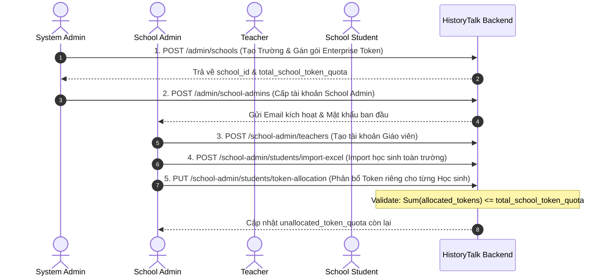
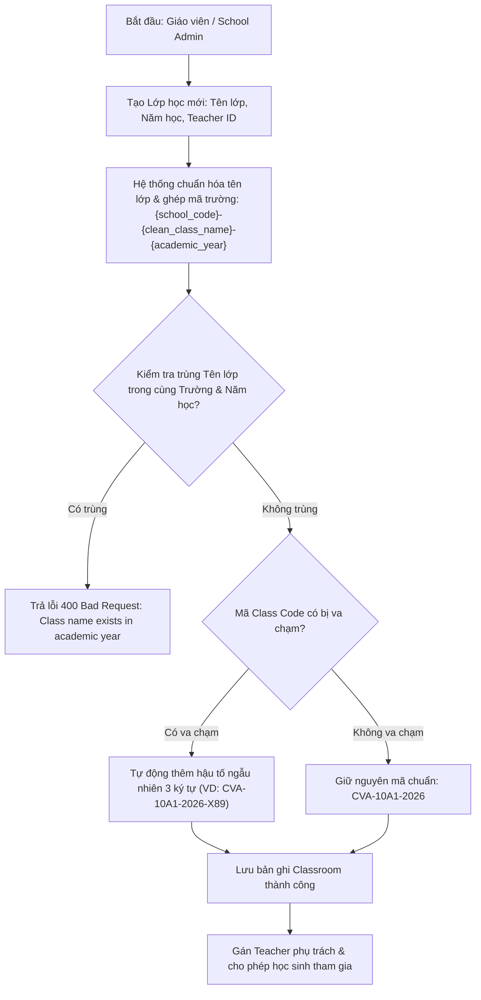

# 🔄 SPRINT 5 — BUSINESS FLOWS & ARCHITECTURE
> **Chủ đề:** SaaS School Onboarding, RBAC Phân quyền, Token Allocation Engine & Classroom Management  
> **Áp dụng cho:** Sprint 5 (04/10/2026 – 10/10/2026)  

---

## 📑 TÀI LIỆU LUỒNG NGHIỆP VỤ CHI TIẾT

👉 **Xem tài liệu chi tiết từng bước (Step-by-step & Sequence Diagrams):**  
📄 **[saas_classroom_and_token_allocation_business_flow.md](file:///c:/Users/trand/OneDrive/Documents/Semester%207/SWD392/SWD392_FinalProject_Git/docs/sprints/sprint_5/business_flows/saas_classroom_and_token_allocation_business_flow.md)**

---

## 1. TỔNG QUAN LUỒNG ONBOARDING TRƯỜNG HỌC & TOKEN ALLOCATION

---

## 2. TỔNG QUAN LUỒNG QUẢN LÝ LỚP HỌC & SINH MÃ CLASS CODE THÔNG MINH

