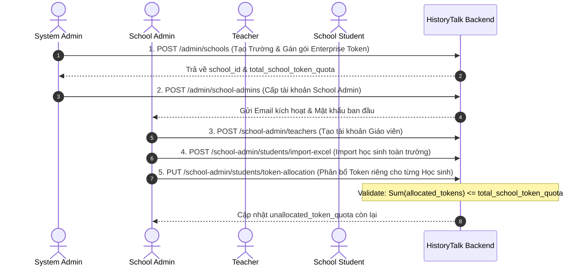
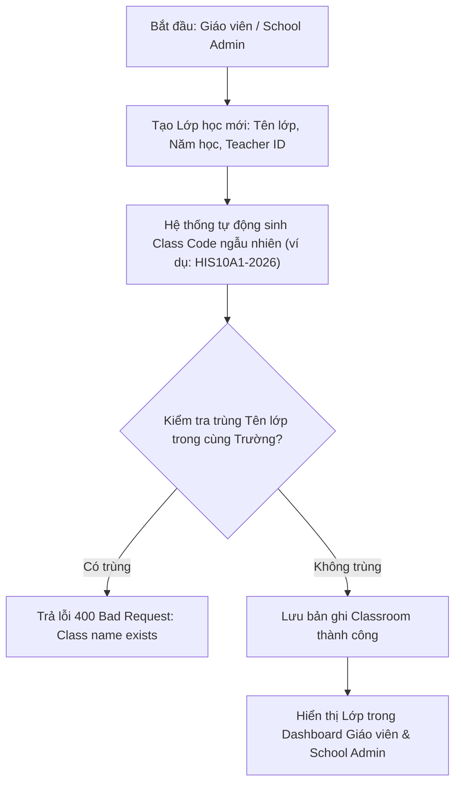

# 🔄 SPRINT 5 — BUSINESS FLOWS & ARCHITECTURE
> **Chủ đề:** SaaS School Onboarding, RBAC Phân quyền, Token Allocation Engine & Classroom Management  
> **Áp dụng cho:** Sprint 5 (04/10/2026 – 10/10/2026)  

---

## 1. LUỒNG NGHIỆP VỤ ONBOARDING TRƯỜNG HỌC & TOKEN ALLOCATION

---

## 2. LUỒNG QUẢN LÝ LỚP HỌC & SINH MÃ CLASS CODE

