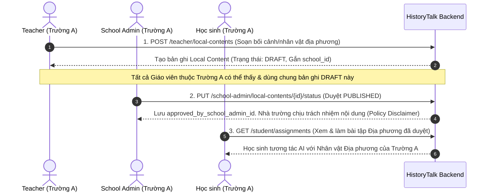
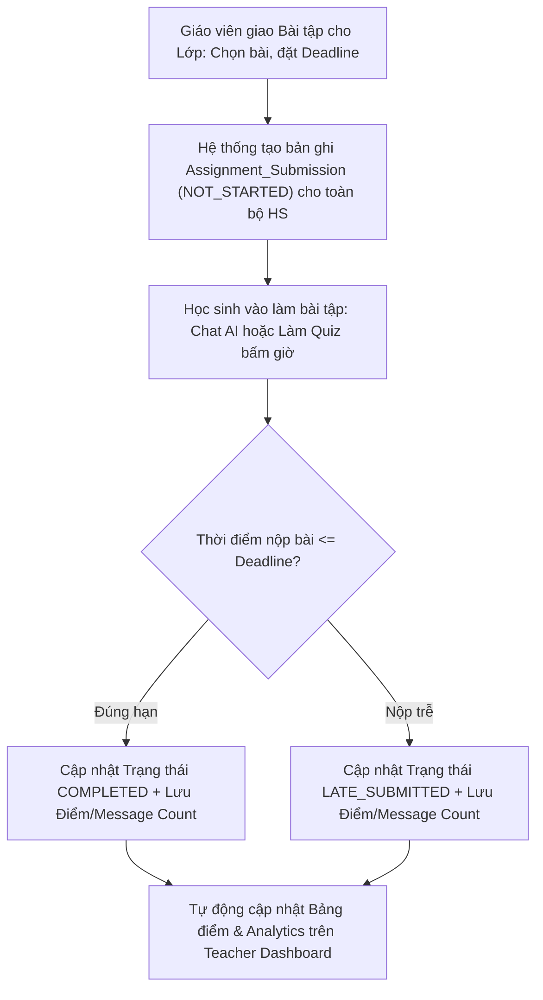

# 🔄 SPRINT 6 — BUSINESS FLOWS & ARCHITECTURE
> **Chủ đề:** Local Content Governance & Disclaimer Policy, Assignment & Deadline Engine, 5 Analytics Dashboards  
> **Áp dụng cho:** Sprint 6 (11/10/2026 – 17/10/2026)  

---

## 1. LUỒNG QUẢN LÝ & DUYỆT NỘI DUNG LỊCH SỬ ĐỊA PHƯƠNG (LOCAL CONTENT WORKFLOW)

---

## 2. LUỒNG GIAO BÀI TẬP, THU BÀI VÀ CẬP NHẬT DASHBOARD GIÁO VIÊN

