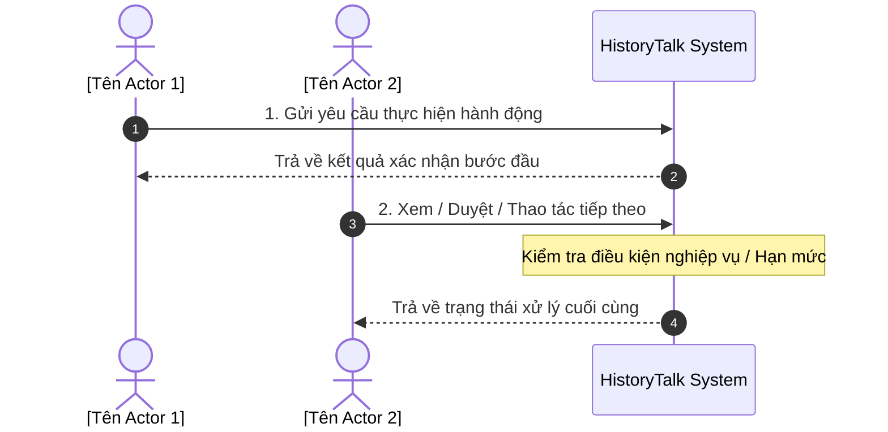
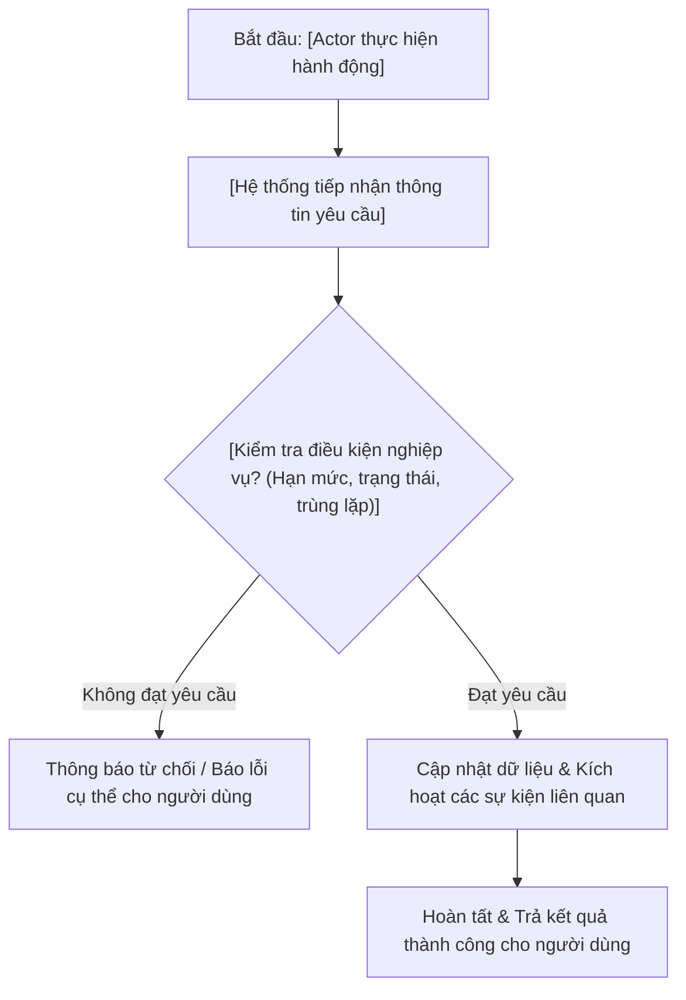

# 📘 HƯỚNG DẪN CHUẨN HÓA TÀI LIỆU NGHIỆP VỤ SPRINT (BUSINESS DOCUMENTATION GUIDE)
> **Dự án:** HistoryTalk — SaaS Historical Education Platform  
> **Mục đích:** Bộ quy chuẩn cấu trúc thư mục và mẫu viết nội dung tài liệu nghiệp vụ (Sprint Business Documentation) dành cho Developer và AI Agent khi soạn thảo các Sprint tiếp theo (dựa trên chuẩn mẫu của `sprint_5` và `sprint_6`).  
> *Lưu ý: Tài liệu này thuần túy quy định về mặt tổ chức tài liệu nghiệp vụ (Business Requirements & User Stories), các đặc tả kỹ thuật/công nghệ (Technical Specification) sẽ được quản lý ở tài liệu kỹ thuật riêng.*

---

## 📂 1. CẤU TRÚC THƯ MỤC CHUẨN CỦA MỘT SPRINT

Mỗi Sprint bắt buộc phải nằm trong thư mục `docs/sprints/sprint_{X}/` và phân chia chính xác thành 2 nhánh con:

```
docs/sprints/sprint_{X}/
├── README.md                          <-- File mục lục & tổng quan toàn bộ Sprint
├── user_stories/                      <-- Thư mục chứa các tài liệu User Story & Template đính kèm
│   ├── [task_group_name_1].md         <-- File US theo nhóm tính năng 1
│   ├── [task_group_name_2].md         <-- File US theo nhóm tính năng 2
│   └── [data_name]_template.csv/.xlsx <-- File mẫu dữ liệu (nếu task có import/export)
└── business_flows/                    <-- Thư mục chứa sơ đồ luồng nghiệp vụ tổng quan
    └── [flow_group_name].md           <-- Sơ đồ Sequence và Flowchart nghiệp vụ bằng Mermaid
```

---

## 📝 2. QUY CHUẨN NỘI DUNG TỪNG FILE TRONG SPRINT

### 📌 Phần 2.1: File `README.md` (Tổng quan Sprint)

* **Vị trí:** `docs/sprints/sprint_{X}/README.md`
* **Mục tiêu:** Cung cấp bức tranh toàn cảnh về mục tiêu nghiệp vụ của sprint, thời gian thực hiện, phân công trách nhiệm và liên kết điều hướng đến tất cả các tài liệu con.
* **Cấu trúc khung chuẩn:**

```markdown
# 🏆 SPRINT {X} OVERVIEW & DOCUMENTATION ({DD/MM/YYYY} – {DD/MM/YYYY})
> **Mục tiêu chính:** [Tóm tắt 1-2 câu về giá trị nghiệp vụ cốt lõi sprint mang lại]  
> **Thành viên phụ trách:** [Tên và username của các thành viên]  

---

## 📂 THƯ MỤC CẤU TRÚC TÀI LIỆU SPRINT {X}

### 1. 📂 User Stories (Theo Nội dung Task):
* 📄 **[[ten_file_1].md](file:///path/to/[ten_file_1].md):** 
  * `US-SP{X}-01` (Người phụ trách): Tóm tắt tên Story 1.
  * `US-SP{X}-02` (Người phụ trách): Tóm tắt tên Story 2.
* 📄 **[[ten_file_2].md](file:///path/to/[ten_file_2].md):**
  * `US-SP{X}-03` (Người phụ trách): Tóm tắt tên Story 3.

### 2. 📂 Business Flows (Luồng Nghiệp vụ):
* 🔄 **[[ten_flow].md](file:///path/to/[ten_flow].md):** Sơ đồ Sequence & Flowchart cho luồng [tên luồng chính của sprint].
```

---

### 📌 Phần 2.2: Thư mục `business_flows/*.md` (Luồng Nghiệp vụ)

* **Vị trí:** `docs/sprints/sprint_{X}/business_flows/[flow_group_name].md`
* **Mục tiêu:** Diễn giải các luồng tương tác nghiệp vụ giữa Người dùng (Actors) và Hệ thống bằng sơ đồ trực quan (Mermaid).
* **Cấu trúc gồm 2 phần chuẩn:**
  1. **Luồng tương tác tuần tự (Sequence Diagram):** Thể hiện thứ tự các bước người dùng thao tác, dữ liệu gửi vào hệ thống, các phản hồi kết quả và thông báo.
  2. **Luồng xử lý nghiệp vụ & Rẽ nhánh (Flowchart):** Thể hiện các điều kiện kiểm tra nghiệp vụ (quyền hạn, hạn mức khả dụng, tính trùng lặp, xét duyệt chính sách) và các hướng xử lý tương ứng.

* **Cấu trúc mẫu Markdown:**

```markdown
# 🔄 SPRINT {X} — BUSINESS FLOWS
> **Chủ đề:** [Tên chủ đề nghiệp vụ của Sprint]  
> **Áp dụng cho:** Sprint {X} ({DD/MM/YYYY} – {DD/MM/YYYY})  

---

## 1. LUỒNG NGHIỆP VỤ [TÊN LUỒNG CHÍNH]



---

## 2. QUY TRÌNH XỬ LÝ & ĐIỀU KIỆN RẼ NHÁNH


```

---

### 📌 Phần 2.3: Thư mục `user_stories/*.md` (Đặc tả User Stories)

* **Vị trí:** `docs/sprints/sprint_{X}/user_stories/[task_group_name].md`
* **Quy tắc phân file:** Mỗi file gom nhóm từ **2 đến 5 User Stories** có cùng phân hệ nghiệp vụ để tài liệu gọn gàng, dễ theo dõi.
* **Cấu trúc khung chuẩn gồm 2 phần:**

#### 1. Bảng Tổng hợp User Stories (Summary Table)
Đặt ở đầu file để người đọc có cái nhìn tổng quan ngay lập tức:
```markdown
# 📋 USER STORIES: [TÊN PHÂN HỆ VIẾT HOA]
> **Sprint:** Sprint {X} ({DD/MM/YYYY} – {DD/MM/YYYY})  
> **Phân hệ:** [Tên phân hệ nghiệp vụ]  

---

## 📌 TỔNG HỢP USER STORIES

| Story ID | Tên User Story | Actor | Người phụ trách | API Endpoint chính |
| :--- | :--- | :--- | :--- | :--- |
| **`US-SP{X}-01`** | [Tên ngắn gọn Story 1] | `[Actor 1]` | 🟢 Khải (KhaiVDD) | `POST /api/v1/...` |
| **`US-SP{X}-02`** | [Tên ngắn gọn Story 2] | `[Actor 2]` | 🔵 Dinh (DinhTQ)  | `GET /api/v1/...`  |
```

#### 2. Chi tiết từng User Story
Mỗi User Story phải tuân thủ đúng định dạng tiêu đề và các trường thông tin:

```markdown
### 🆔 US-SP{X}-{YY}: [Tên User Story] ([English Title])
* **Actor:** `[System Admin / School Admin / Teacher / School Student / Customer]`
* **Thời gian thực hiện:** DD/MM/YYYY – DD/MM/YYYY
* **Phụ trách:** 🟢 Khải (KhaiVDD) hoặc 🔵 Dinh (DinhTQ)
* **User Story:**  
  Là [Actor], tôi muốn [Hành động/Tính năng muốn có], để [Mục đích / Giá trị mang lại].

* **File Template Mẫu (Nếu có bài toán Import/Export dữ liệu):**
  - Đặt liên kết tới file: `[ten_template.csv](file:///path/to/ten_template.csv)`
  - Bảng quy chuẩn các cột dữ liệu:
    | Tên Cột (Header) | Kiểu Dữ Liệu | Bắt buộc | Mô tả & Ràng buộc Nghiệp vụ |
    | :--- | :--- | :---: | :--- |
    | `field_1` | String | **Có** | Ý nghĩa, quy tắc hợp lệ |
    | `field_2` | String | Không | Ý nghĩa, giá trị mặc định nếu để trống |

* **Acceptance Criteria (AC):**
  1. API `[METHOD] /api/v1/...` tiếp nhận các thông tin đầu vào từ người dùng.
  2. Ràng buộc nghiệp vụ & Validation:
     - Kiểm tra dữ liệu bắt buộc không được để trống.
     - Kiểm tra tính duy nhất (không trùng lặp mã/email trong hệ thống).
     - Kiểm tra quyền sở hữu (người dùng chỉ được thao tác trên dữ liệu thuộc phạm vi của mình).
  3. Xử lý nghiệp vụ:
     - Mô tả các bước hệ thống xử lý (tính toán hạn mức, thay đổi trạng thái, kích hoạt email/thông báo).
  4. Kết quả đầu ra:
     - Thông báo thành công kèm dữ liệu trả về cho người dùng.
     - Trường hợp không hợp lệ: Trả về thông báo lỗi chi tiết, rõ ràng lý do từ chối.
```

---

### 📌 Phần 2.4: File Mẫu Dữ Liệu (`*_template.csv` / `*_template.xlsx`)

* **Vị trí lưu:** Đặt **ngay bên trong thư mục `user_stories/`** của sprint đó, đứng cùng thư mục với file User Story chứa nghiệp vụ tương ứng.
* **Quy tắc đặt tên:** `[entity_name]_template.csv` hoặc `[entity_name]_template.xlsx` (ví dụ: `student_import_template.csv`).
* **Yêu cầu dữ liệu mẫu:**
  1. **Tên cột (Header):** Viết bằng tiếng Anh, chuẩn `snake_case` (ví dụ: `student_code,full_name,email,dob`).
  2. **Dữ liệu mẫu (Sample Data):** Chứa tối thiểu 3-5 dòng thể hiện các trường hợp thực tế:
     - Dòng có đầy đủ tất cả thông tin.
     - Dòng chỉ có các thông tin bắt buộc (thông tin tùy chọn để trống).
     - Dòng có trường hợp đặc biệt (ví dụ: mật khẩu tự sinh vs mật khẩu nhập sẵn).
  3. **Định dạng tiếng Việt:** File `.csv` phải được lưu chuẩn **UTF-8 có BOM (`\uFEFF`)** để khi người dùng mở bằng Excel trên máy tính không bị lỗi hiển thị font tiếng Việt.

---

## 🧭 3. BẢNG CHECKLIST KIỂM TRA TÀI LIỆU SPRINT

Trước khi hoàn tất soạn thảo một Sprint mới, hãy đối soát danh sách sau:

- [ ] Folder sprint được đặt tên đúng chuẩn: `docs/sprints/sprint_{X}/`.
- [ ] Có đầy đủ 2 thư mục nghiệp vụ con: `user_stories/` và `business_flows/`.
- [ ] File `README.md` của sprint đã có mục tiêu, timeline, phân công và link đến tất cả các tài liệu con.
- [ ] File Master `docs/sprints/README.md` đã cập nhật thêm mục của sprint mới.
- [ ] Các Story ID được đánh số nhất quán: `US-SP{X}-01`, `US-SP{X}-02`,...
- [ ] Mỗi User Story có đủ 4 phần: Actor, User Story narrative (*"Là... tôi muốn... để..."*), Acceptance Criteria, và API Endpoint.
- [ ] Các sơ đồ trong `business_flows/*.md` sử dụng đúng cú pháp Mermaid hợp lệ.
- [ ] Nếu có file template dữ liệu mẫu, file nằm đúng trong `user_stories/` và đã được liên kết trong User Story.
